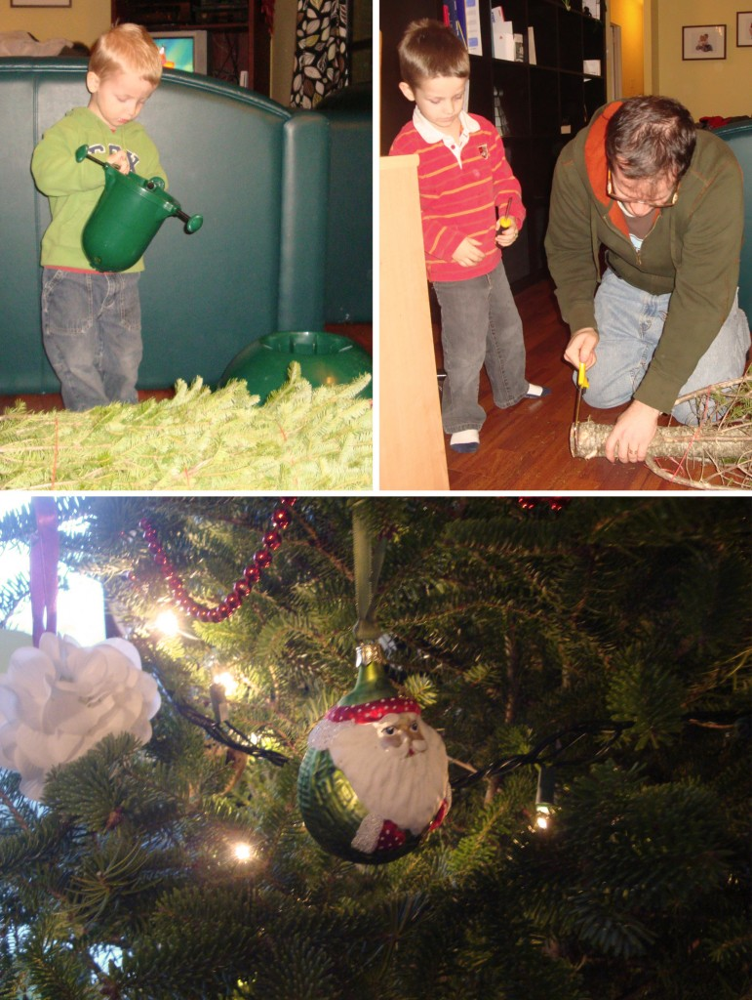
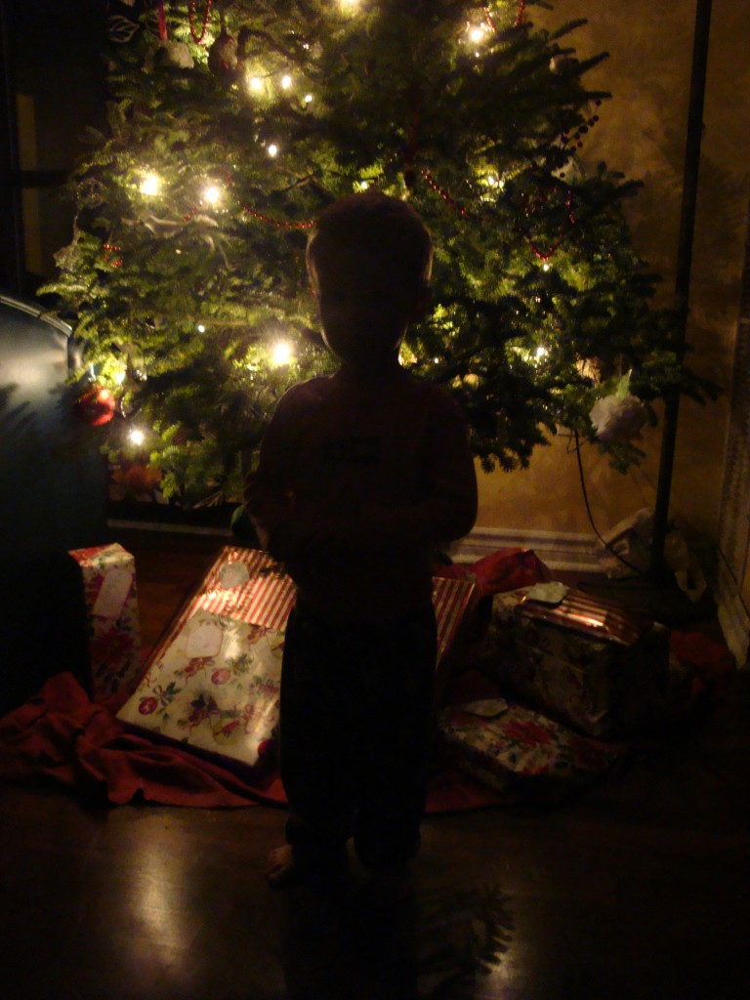

Après sept ans de mariage, il était temps qu'on est notre premier sapin de Noël. L'année passée Ézékiel n'arrêtait pas de m'en demander un. et même là j'étais déjà convaincue. Peut importe où on n'allait être ce Noël ci, j'en voulais un sapin.

Alors cela dit, nous avons été en famille chercher le fameux sapin qui allait rendre notre salon chaleureux durant le mois de décembre. Nous avons suivi le conseil de nos amis et nous avons été acheter l'arbre au magasin IKEA. Grand ou petit, tous les sapins sont à 20$. Puis à l'achat, on nous remet un coupon de 20$ de radais sur notre prochain achat là-bas. Pas mal pantoute!

Donc voici toute la famille qui veux contribuer d'une façon ou d'une autre. Caleb qui cherche comment le pied de l'arbre fonctionne. Papa qui scie le tronc et Ézékiel qui pense aider avec son tournevis. Le premier soir qu'on a laisser les branches  s'ouvrirent, je suis rentrée dans le salon et l'odeur que dégageait le sapin m'a rappelé des souvenirs de lorsque j'étais jeune. J'étais toute heureuse d'avoir, un bref instant, eu l'impression de vivre à Montréal avec ma famille.

Qui suis-je? Un petit lutin bien sûr](http://famillecarter.com/blog/wp-content/uploads/2012/12/DSC05244.jpg)
