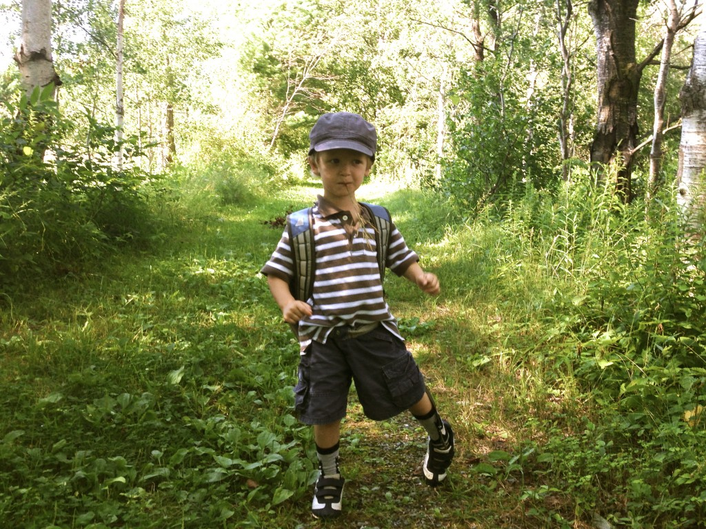
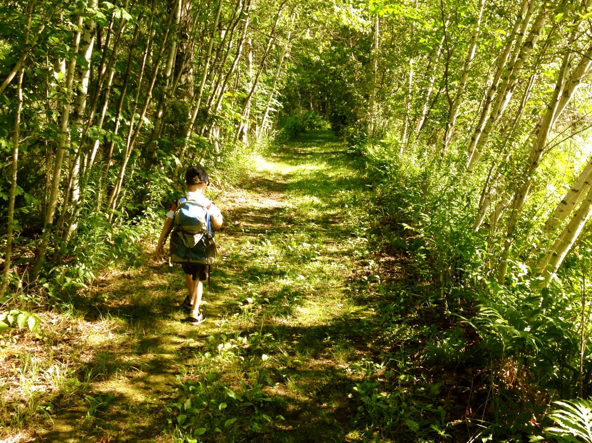
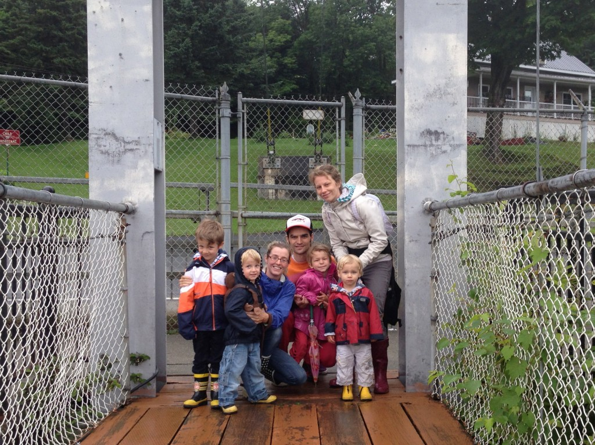
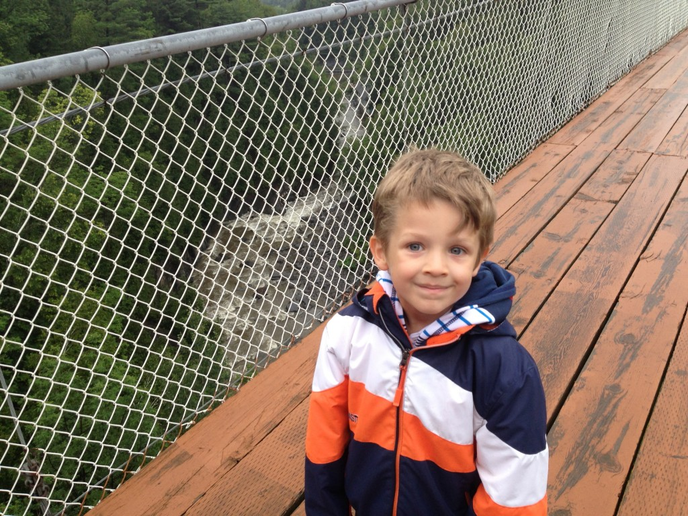
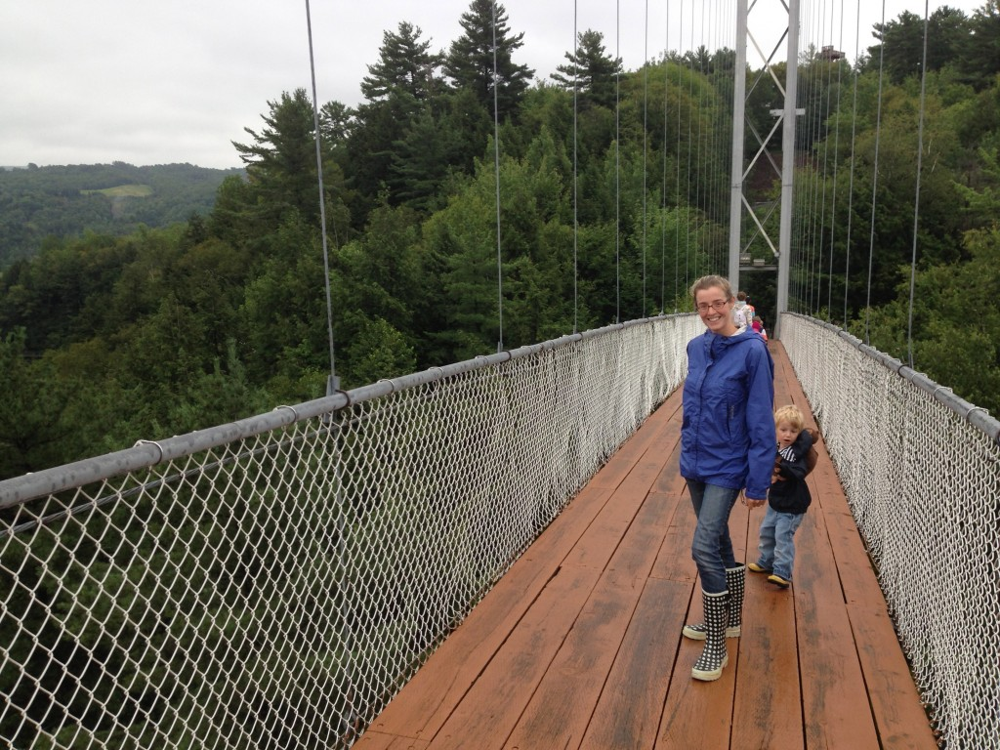
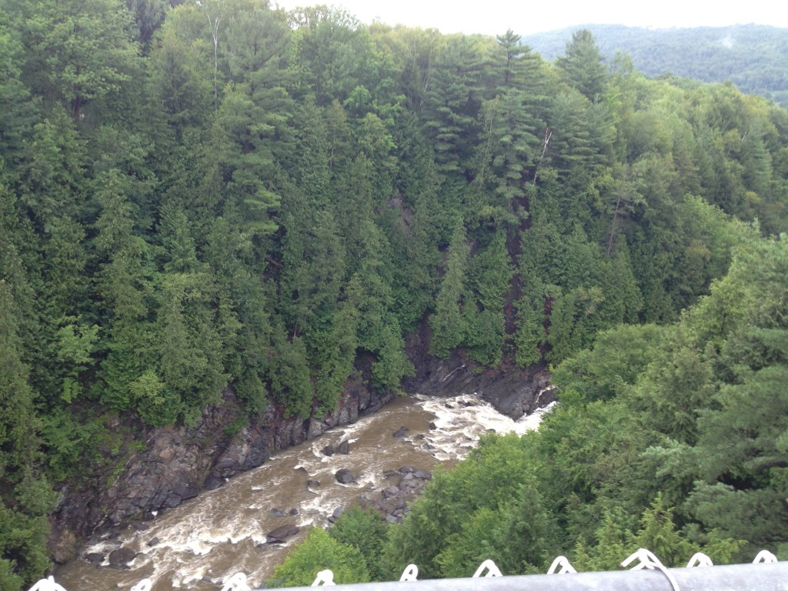
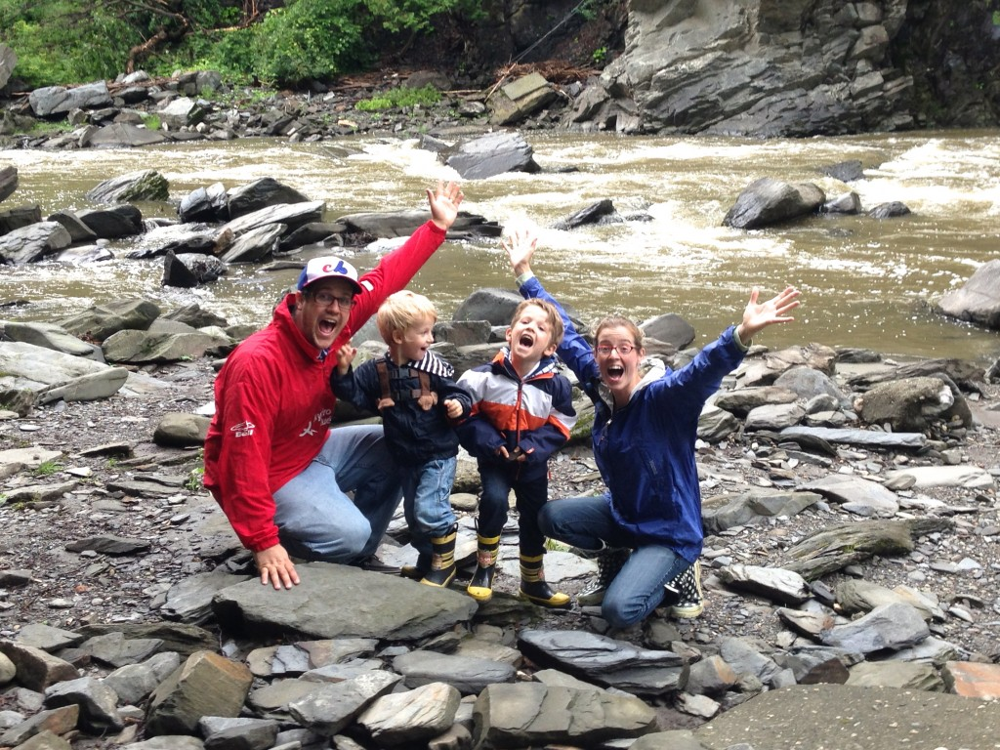

Je sais que nous sommes au mois d'octobre, mais je tiens quand même à mentionner deux belles activités que nous avons fait au mois de juillet.

La première fut une belle ballade dans un sentier près du lac brome. J’aime le fait que chacun apporte son propre sac-à-dos avec sa collation.

 

À peine quatre jours plus tard nous avons été au parc de la gorge de Coaticook avec la famille Plouffe. Nous voici tous sur la passerelle suspendue près à défier notre peur des hauteurs. Émilie semblait particulièrement sur les nerfs de nous savoir à 50 mètres du sol.

 

On a une vue exceptionne sur la gorge.

Ici nos braves ont monté jusqu’au sommet d’une belle tour d’observation, appeler familièrement la tour de Rapunzel” . 

Sur le site, on a pu aussi voir un barrage, une centrale hydroélectrique et une grotte.

Il n’était pas question de passer par Coaticook sans s’arrêter à leur fameux bar laitier. Je n’ai pas de photos de ce moment, mais vous pouvez être sûr qu’on s’est régalé. Vraiment la Coaticook, c’est la meilleur crème glacée d’ici!
