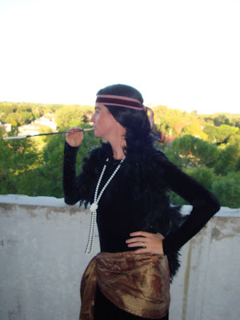
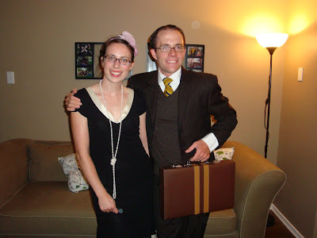
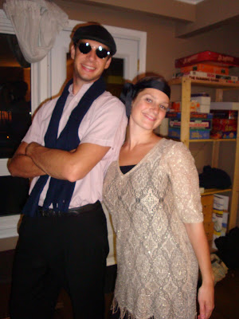
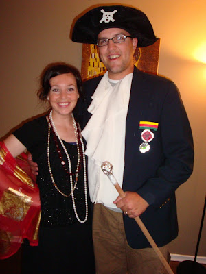
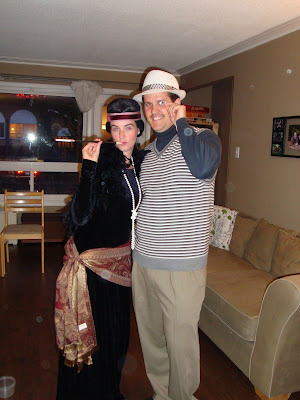
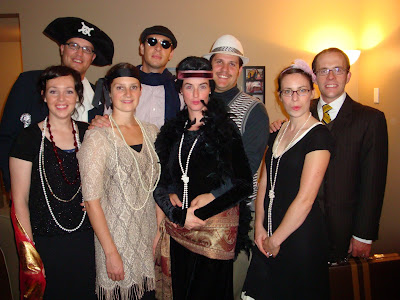
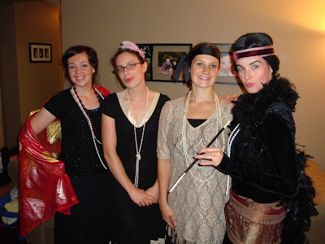
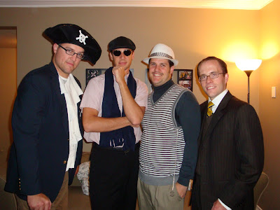

Il y a presqu'un an, Emily a trouvé un vieux jeu de "Meurtre et mystère". Probablement le premier de la sorte! Il faut croire que ce fut difficile d'organiser cette soirée puisque ce n'est qu'hier soir que nous avons finalement pu faire revivre cette lugubre journée de l'année 1925. 
  
Par malheur, notre invitation s'est perdue à la poste. À bien y repenser peut-être pas si malheureux que ça, puisque j'ai apprit qu'une des participantes avait dû mettre son invitation sur la galerie pour la faire aérer tellement elle sentait l'arrière grand-mère. Quand je vous dit que c'était un vieux jeu!  
  
N'ayant jamais joué à un de ces jeux, je fut très heureuse d'être invitée. Jean-Michel et moi sommes partis plein d'espoir au village des valeurs. C'est à notre retour que Mlle Lucie et M. Jules sont rentrés en scène.  

  

Lucinda Gucie  
  
Jules Hieffe  
  

Nos hôtes: Emily et Doug  

  

Jesse et Sarah  

  

Caylee et Aaron  

  

Marjorie et Jean-Michel  

  
  

Et le 5ème couple de la soirée  
Margo et Zeke  

  

Avant de commencer l'interrogatoire on a prit quelques photos de groupe. D'après vous, qui a une tronche de meurtrier: Le capitaine du bateau, la propriétaire d'un club de danse, le pilotte de course, la chanteuse d'Opéra, le bijoutier, la séduiseuse d'homme, le banquier ou la propiétaire d'un vignoble???  

  

  
  

