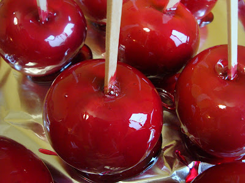
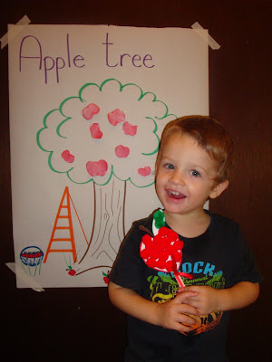
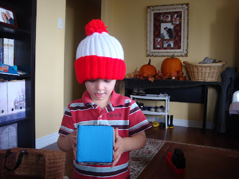
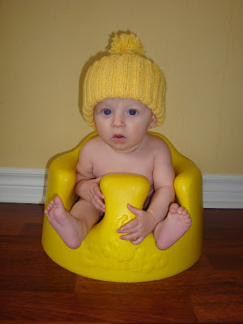
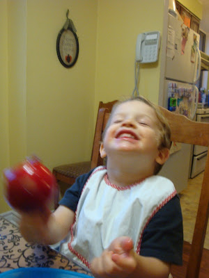

  
  
  

Depuis le mois de septembre toute la famille est rentrée dans une petite routine qui n'a rien d'ennuyeux. J'ai le goût de vous parler d'une journée en particulier qui a été bien active.

Depuis maintenant un mois, deux autres mamans et moi organisons une pré-maternel pour nos enfants. À chaque semaine l'une d'entre nous reçoit les tous petits de 2-3 ans et enseigne sur un thême. Pendant ce temps les deux autres mamans ont un bon deux heures de libre pour faire ce qu'elles veulent.  

Mercredi passé j'ai reçu les enfants à la maison pour la première fois. Le thème de la journée était « les pommes ». La première heure à été plutôt rock and roll, puis la situation s'est finalement améliorée. C'est vrai que ça prend beaucoup d'effort pour organiser tout ça, mais après mûre réflexion j'ai trouvé que ça en vallait vraiment la peine.

  

Ézékiel nous montre son bricolage.

  

  

En après-midi nous avons eu un beau cadeau de notre voisine Pauline. Elle nous a gentiment donné deux tuques qu'elle a fait elle-même pour nos deux garçons.  

  

Rouge et Blanc (couleurs des canadiens)

  

  

Jaune comme un petit canard.

  

  

Aussi cet après-midi là j'ai fait des pommes au sucre d'orge. Je trouve que c'est une très belle et bonne friandise pour l'automne. De plus j'aimerais en faire une tradition annuelle. Ézékiel et moi avons eu beaucoup de plaisir a déguster nos pommes ensemble.  

  

  

La journée était loin d'être terminée. En fin d'après-midi j'ai commencé un de mes buts, c'est à dire de faire cinq nouvelles recettes cette semaine. Maintenant que j'ai réussi à le compléter je peux dire que nous avons tous apprécié la nouveauté et que ces recettes vont rentrer dans nos classiques.

Puis pour finir la journée en beauté, j'ai été à une activité de la Société de Secours. Chose sûre, on ne se tourne pas les pouces ici.
