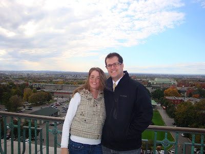
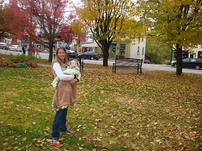

Pour la longue fin de semaine de l'Action de grâce, nous avons fait découvrir la ville de Montréal à deux couples d'amis.

La semaine d'avant j'étais en train de préparer notre circuit et je suis tombée sur la vidéo [« Montréal en deux minutes »](http://www.tourisme-montreal.org/). Juste à regarder ce film j'ai eu la chaire de poule. J'étais fière de ma ville et j'avais hâte de partager cet endroit avec nos amis.

Notre expérience s'est très bien déroulée. Mais même avec tout nos efforts pour leur faire ressentir l'esprit de l'endroit, je doute fortement qu'ils aient vu Montréal comme moi. Chaque pas que je faisais me rappelait des souvenirs de mon passé. Je n'y voyais non seulement l'histoire de la ville, mais aussi mon histoire à moi. J'aime tellement cette ville!  

Quand même, en tant que touristes nos amis ont bien apprécié leur visite à Montréal . Et à part un total de 20 heures en quatre jours en voiture, on est pas mal sûr qu'ils en garderont un bon souvenir.  

Sur le balcon de l'Oratoire St-Joseph

  

  

Ici dans le petit village de Knowlton.  

  

  

