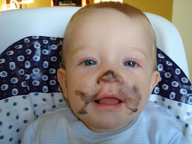
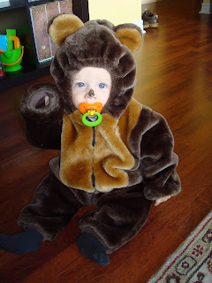
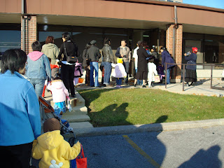
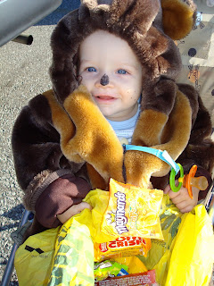
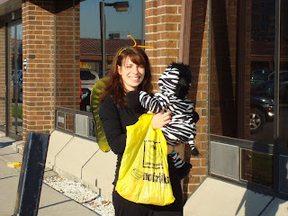
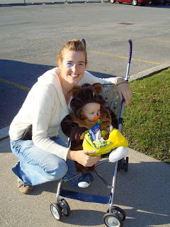

Ce matin le 31 octobre, Ézékiel a enfilé son premier costume d'Halloween. Dans toute sa beauté nous sommes allés au centre Early Years de notre quartier. Ça ressemble à une garderie ,mais gratuite. Les enfants (0-6 ans) vont y jouer en la presence de leurs parents. Zeke a rencontré tout plein d'amis, dont sa préférée Margo.  
  
J'ai bien voulu maquiller Ézéquiel pour l'occasion, mais disons que mes trois premières tentatives ont été un échec. J'ai du me résoudre de lui faire que le nez.  
  
  
Voici l'ours le plus dangereux de North York. "GRRRRRRR....."  
  
  
Les 35 familles que nous étions, avons fait une parade dans la rue et avons récolté des bonbons dans les commerces au alentour.  
  
Une récolte qui fait bien plaisir à maman... et à Zeke bien sûr!  
  
  
Margo était déguisée en zèbre, son beau gros derrière à fait fureur.  
Pour finir, au centre nous avons chanter et danser. Après autant de plaisir nos amis nous ont gentiment invité a revenir plus souvent. Ce que nous alons faire.  
  
C'était le party des petits , mais ce soir il va y en avoir un autre pour les grands. À suivre...
