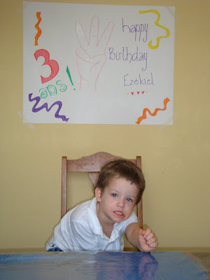
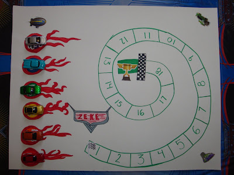
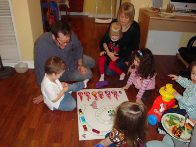
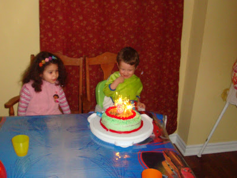
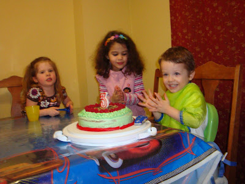
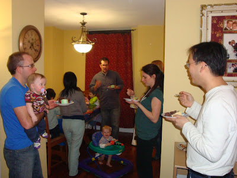
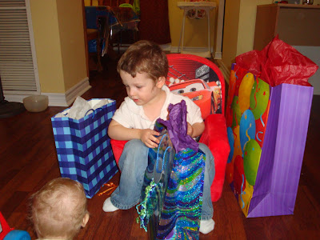

  
  

Vendredi passé j'étais en train de gonfler des ballons quand Ézékiel a comprit par lui-même qu'on allait recevoir à la maison. J'ai décider de briser le secret et je lui ai avoué qu'en effet les amis allaient arriver dans moins d'une heure pour fêter ses trois ans. Grave erreurs de ma part. En 30 minutes notre petit monsieur c'est tellement énervé qu'il était tout trempé de sueur. Il sautait d'un côté du salon à l'autre, utilisa son frère comme coussin d'atterrissage et brisa une balloonne. Il était tellement en sueur que j'ai du le mettre dans sa chambre pour qu'il se calme et sèche un peu. La soirée commençait bien! En réalité ça c'est très bien passé. Quatre amis sont venus: Margo, Liviya, Louisa Maria et Tyler.

Ceux qui connaissent bien Ézékiel savent qu'il aime les chiffres. Il est très bon pour compter. C'est pourquoi j'ai fait le jeu du colimaçon. Ézékiel l'a vraiment beaucoup aimé même s'il n'a pas gagné la soirée même de sa fête. Depuis nous y avons rejoué une dizaine de fois. C'est un peu redondant pour Jean-Michel et moi, mais ça fait le bonheur de Zeke. Sa voiture préféré... jaune.  

  

  

Plus tard dans la soirée nous avons sorti le gâteau. Pauvre Zeke, il a eu peur des chandelles étincelantes. « C'est chaud! » et il a eu besoin de l'aide à Louisa pour souffler sur sa chandelle. Si vous vous demandez, le gâteau devait représenter une piste de course qui tourne autour du 3. Mais comme la gâteau était trop petit j'ai du mettre les deux voitures au bas du gâteau et non sur la piste. Ça n'a pas vraiment eu l'effet voulu, mais pour Zeke c'était le plus beau gâteau au monde.  

Zeke qui a peur des étincelles.

  

Pendant l'heure du dessert Caleb prenait sa place au travers des invités. Heureux comme tout notre petit homme souriait à tout le monde. J'ai essayé de le coucher à deux reprises. Impossible, il ne voulait aucunement manquer la fête. Caleb a finalement gagné puisqu'il à eu la chance d'assister à la session de déballage de cadeaux.  

Ici Caleb qui fait sa place. "Tassez-vous de là!"  

  

Ézékiel a été terriblement gâté par tous ses amis.

Mille merci à tous pour votre présence et vos beaux cadeaux.

