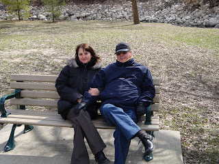
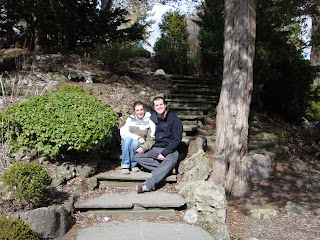
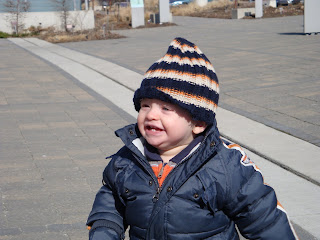
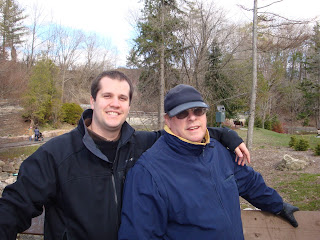
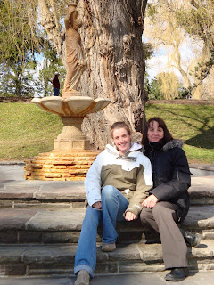
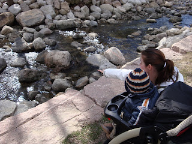

Pour la fin de semaine de Pâques nous avons eu de la belle visite de Montréal. À la grande surprise de mes soeurs et mon frère, mes parents n'ont pas reçu la famille chez eux cette année. Et oui, c'est moi qui les a reçu à Toronto.  

  
Leur première soirée ici, a été un échange de nouvelles, de photos et de cadeaux. Suivi d'une promenade et de jeux. J'ai une confession à faire au sujet du 500. Même après avoir joué à plusieurs reprises avec mes parents, j'ai réalisé que je n'ai pas eu ma dose... j'en veux plus et encore plus. Où sont nos partenaires de 500??? Snif!  
  
Comme papa ne se sentait pas très bien le lendemain, nous avons continué de jouer au jeu " The settlers of Catan" avec maman. En après-midi, on est finalement sortie profiter de la belle journée.  

  
Voici quelques photos que nous avons prit au jardin botanique.  
  

Les grands-parents Lemire  

  
  

Marjo, Jean-Michel et...  

  
  

...Ézékiel. Jean-Michel trouvait que Zeke  
ressemblait à Simplet dans Blanche-neige, avec sa tuque.  
Tout un compliment!  

  
  

Le père et le gendre  

  
  

La mère et la fille  
  
  
Où est le canard? Le voyez-vous?  
  

  
Le temps passe très vite quand on est en bonne compagnie. Le lendemain, c'était déjà le temps pour mes parents de reprendre la route vers Montréal.  
  
Nous étions bien heureux d'avoir de la visite du Québec et c'est avec un sourire que je vous annonce que ce n'est pas terminer. Mélanie et Joe ont planifié venir passer leur vacance d'été ici. Leur circuit touristique est très intéressant: plage de Coberg, Canada Wonderland,...  
À croire qu'il ne faut pas sous-estimer l'Ontario.
