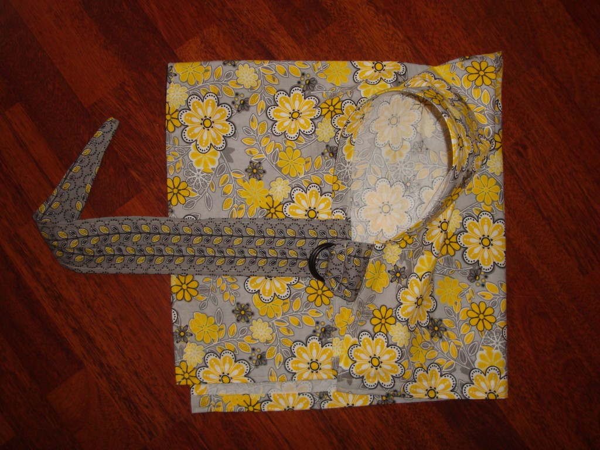
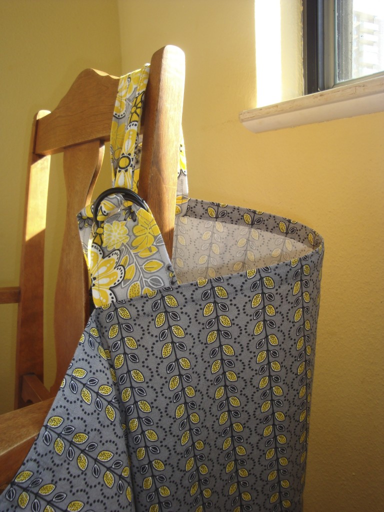
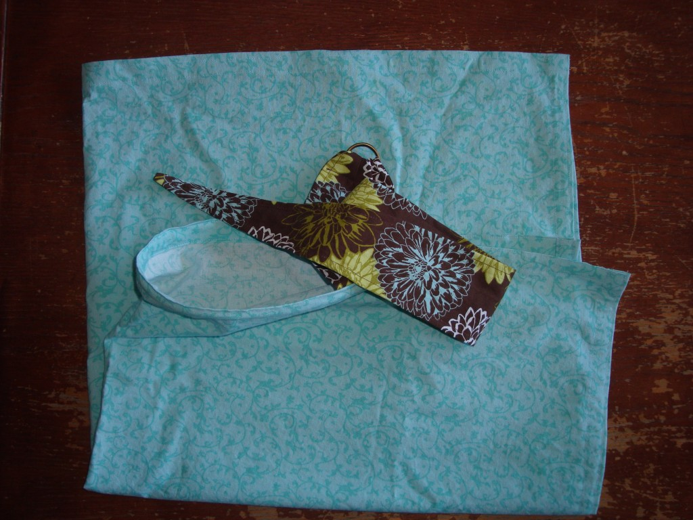
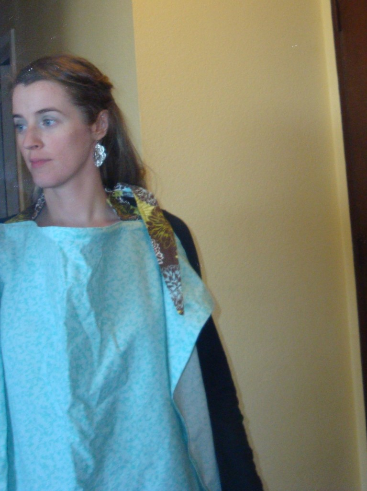

Après mon trip de pitatou, j'ai recommencé celui des couvertures d'allaitement.  C'est étrange, mais j'aime faire ces couvertures. Ce qui est merveilleux, c'est que j'en ai donné trois sur quatre à des mères qui en avaient besoin. Ça fait de beaux cadeaux.

Et oui, je garde le quatrième pour moi. Celui que j'utilisais pour mes deux grossesses est pas mal usé et ça va faire du bien de changer... le jour ou je vais en avoir besoin. Et pour ceux qui ce le demande, non je ne suis pas enceinte. Mais vivement dans la prochaine année.

Donc voici ce que j'ai fait durant les deux dernières semaines.

Cette photo donne une idée de ce à quoi ça ressemble sur quelqu'un. 
