Le mois d’octobre a été bien occupé, spécialement après notre déménagement. Nous avons ouvert des boîtes qui avaient été rangées depuis des mois. Ézékiel était super heureux de retrouver Bussi l’ours. Ça me fait toujours chaud au coeur quand je le voie jouer avec, car c’est un jeu que j’ai reçu quand j’avais à peu près le même âge que lui. C’est dommage que ça n’existe plus, c’est tellement un bon jeu d'apprentissage.

\[caption id="attachment\_1274" align="aligncenter" width="584"\][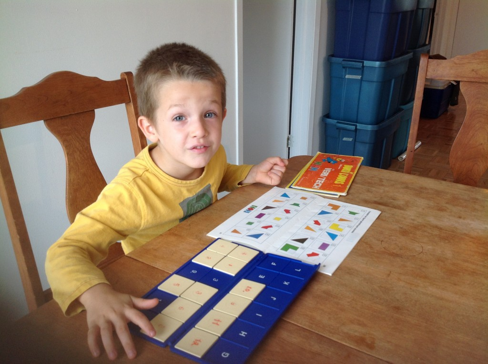](http://famillecarter.com/blog/wp-content/uploads/2013/11/IMG_1229.jpg) Ézékiel retrouve des jeux cachés depuis presque six mois.\[/caption\]

Bref, nous avons aussi été invité par des amis à aller passer du temps avec eux au Mont Tremblant. Malgré la température qui s’était refroidi et la petite pluie, nous avons beaucoup aimé nous retrouver dans la nature avec nos amis. Au grand plaisir de tous, nous avons vu une belle petite famille de cerfs.

\[caption id="attachment\_1275" align="aligncenter" width="584"\][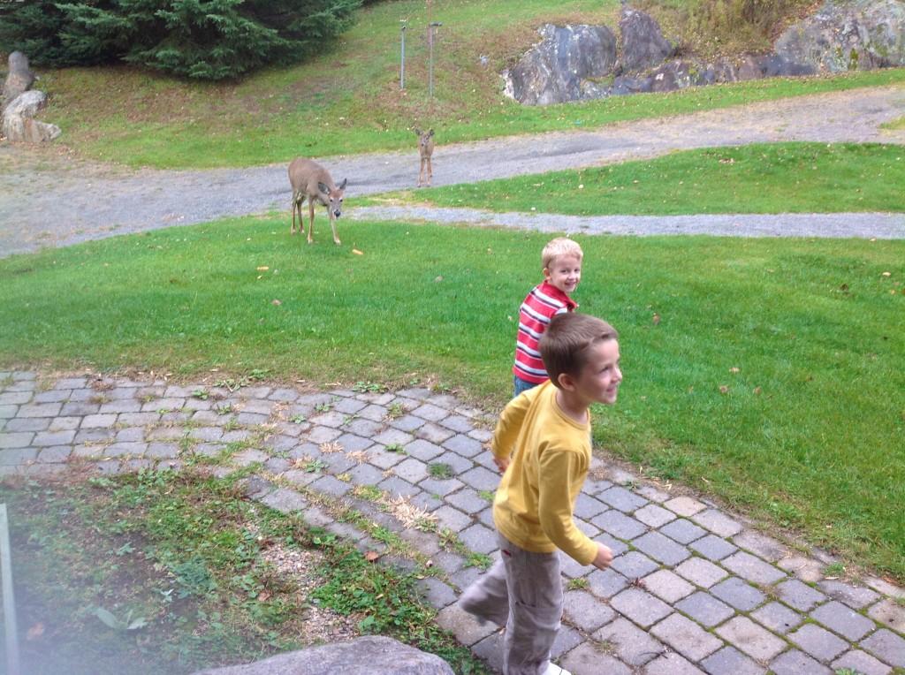](http://famillecarter.com/blog/wp-content/uploads/2013/11/IMG_1250.jpg) De la visite au Mont Tremblant.\[/caption\]

\[caption id="attachment\_1277" align="aligncenter" width="584"\] Dix ans d'amitié\[/caption\]

Aussi, Ézékiel est tombé en amour avec le petit village de Tremblant. “J’ai jamais vu un village comme ici!” Il voulait qu’on y retourne le lendemain matin, en famille. Après notre courte ballade, nous avons commencé la montée du Mont. Cette activité a été la cerise sur le sundae de nos enfants. Définitivement à y retourner en famille.

\[caption id="attachment\_1278" align="aligncenter" width="584"\][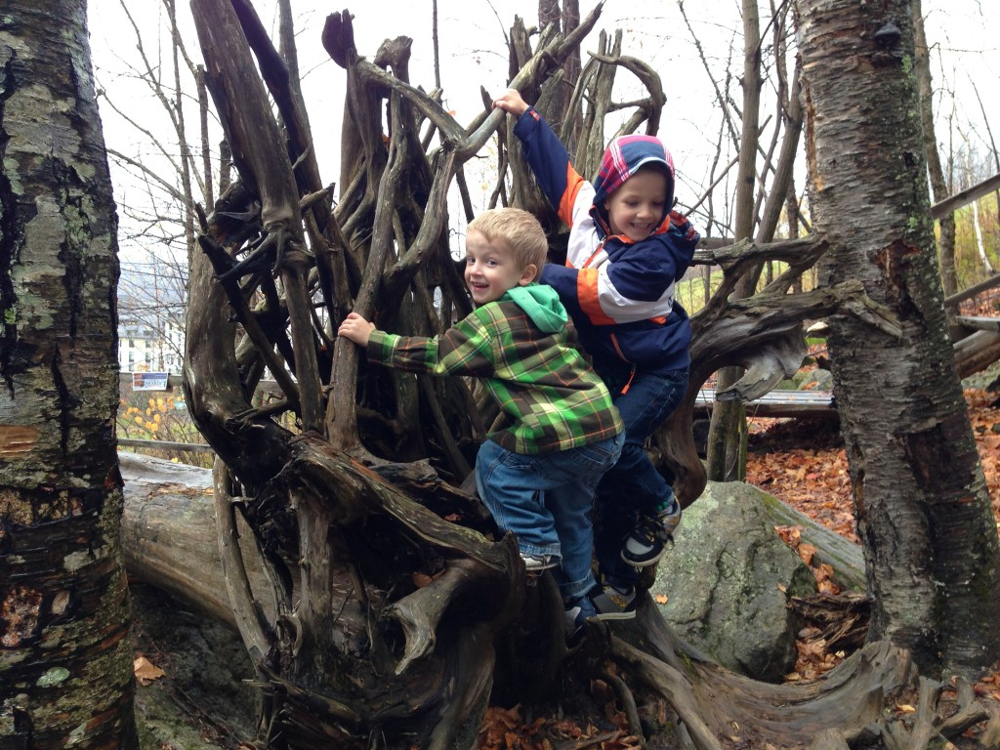](http://famillecarter.com/blog/wp-content/uploads/2013/11/IMG_1738.jpg) Nos deux grimpeurs.\[/caption\]

\[caption id="attachment\_1279" align="aligncenter" width="584"\] Mon homme qui m'a prit en photo.\[/caption\]

Pour l’action de grâce, nous avons été pour la première fois au verger Charbonneau. Nos impressions: très beau site, très grand et bon prix! Résultat, on a ramené un gros 20 livres de pommes à la maison. Puis en soirée les Salm nous on tous bien reçu à souper pour célébrer l'action de grâce.

\[caption id="attachment\_1280" align="aligncenter" width="584"\][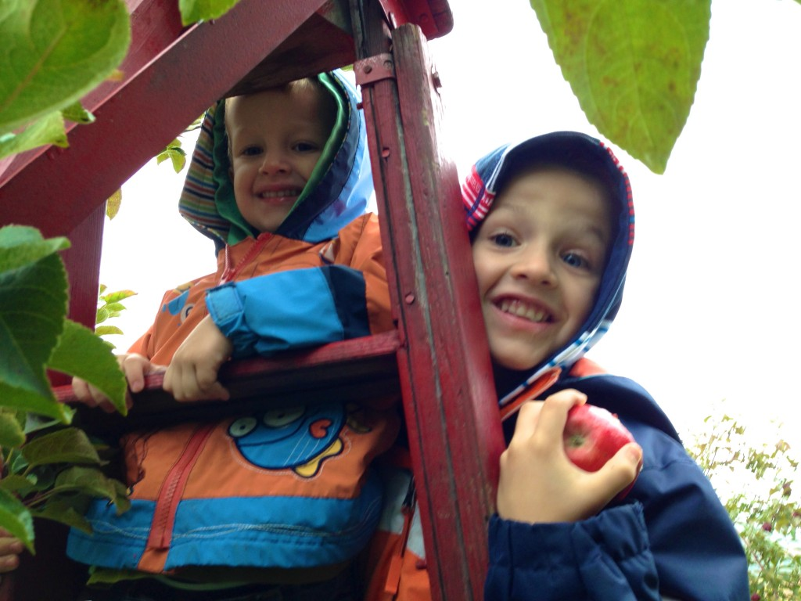](http://famillecarter.com/blog/wp-content/uploads/2013/11/IMG_1655.jpg) Allons trouver des belles grosses pommes rouges pour maman!\[/caption\]

Le mois est loin d’être terminé... À la chapelle nous avons eu une super activitée. Mes deux garçons étaient déguisés en personage du livre de mormon. Je vous donne deux indices.

\[caption id="attachment\_1281" align="aligncenter" width="584"\][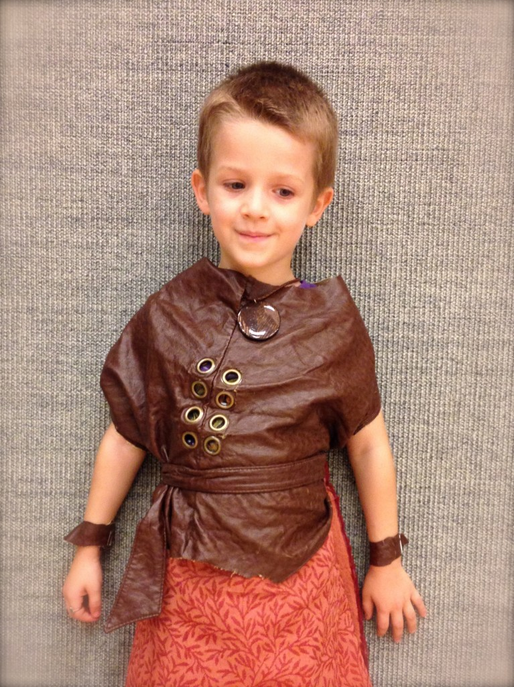](http://famillecarter.com/blog/wp-content/uploads/2013/11/IMG_1776-Version-2.jpg) Mille guerriers\[/caption\]

\[caption id="attachment\_1282" align="aligncenter" width="584"\][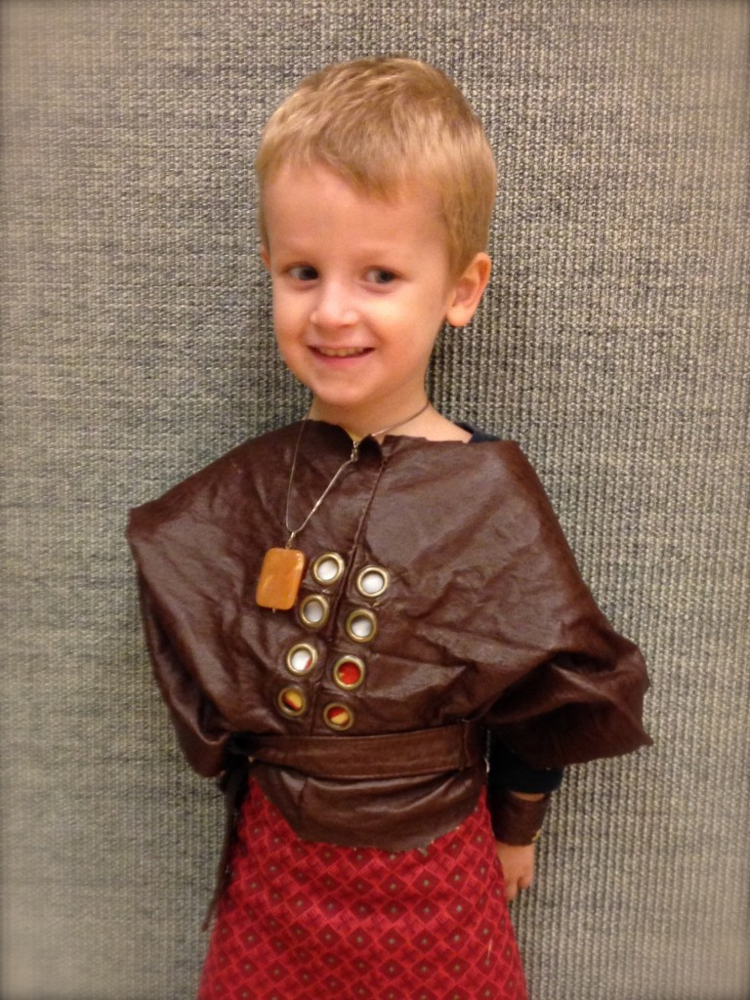](http://famillecarter.com/blog/wp-content/uploads/2013/11/IMG_1781-Version-2.jpg) Un autre mille guerriers. Ça fait combien?\[/caption\]

Cette année je pensais passer mon tour et ne pas faire notre tradition des biscuits d’Halloween. J’en avait beaucoup à faire, mais Ézékiel a tellement insisté que... j’ai fait nos fameux biscuits. Le dimanche suivant nos deux garçons étaient plus qu’heureux de les distribuer aux amis.

\[caption id="attachment\_1276" align="aligncenter" width="584"\][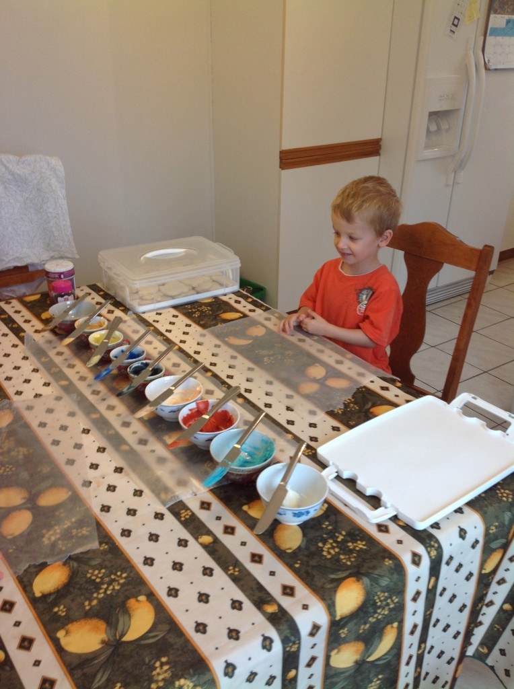](http://famillecarter.com/blog/wp-content/uploads/2013/11/IMG_1260.jpg) Dans l'attende du O.K de maman.\[/caption\]

\[caption id="attachment\_1283" align="aligncenter" width="584"\][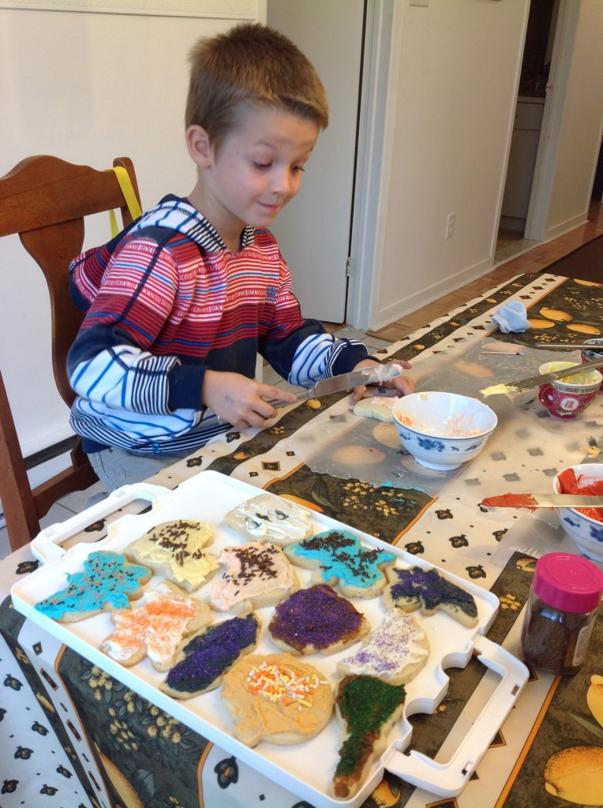](http://famillecarter.com/blog/wp-content/uploads/2013/11/IMG_1264.jpg) Mon petit artiste\[/caption\]

\[caption id="attachment\_1284" align="aligncenter" width="584"\][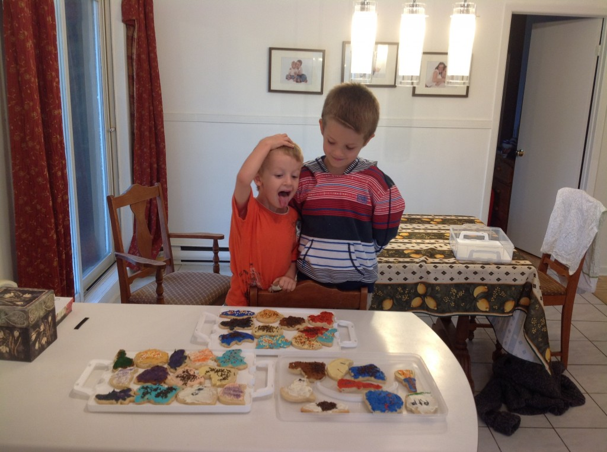](http://famillecarter.com/blog/wp-content/uploads/2013/11/IMG_1267.jpg) Faut-il vraiment les donner?\[/caption\]

Voici notre citrouille de l’année. Vive le petit ensemble de couteaux  sculpter que j’ai acheté il y a maintenant trois ans. Un 10-15$ bien dépensé, car a chaque année je me fais un grand plaisir de les utiliser.

\[caption id="attachment\_1285" align="aligncenter" width="584"\][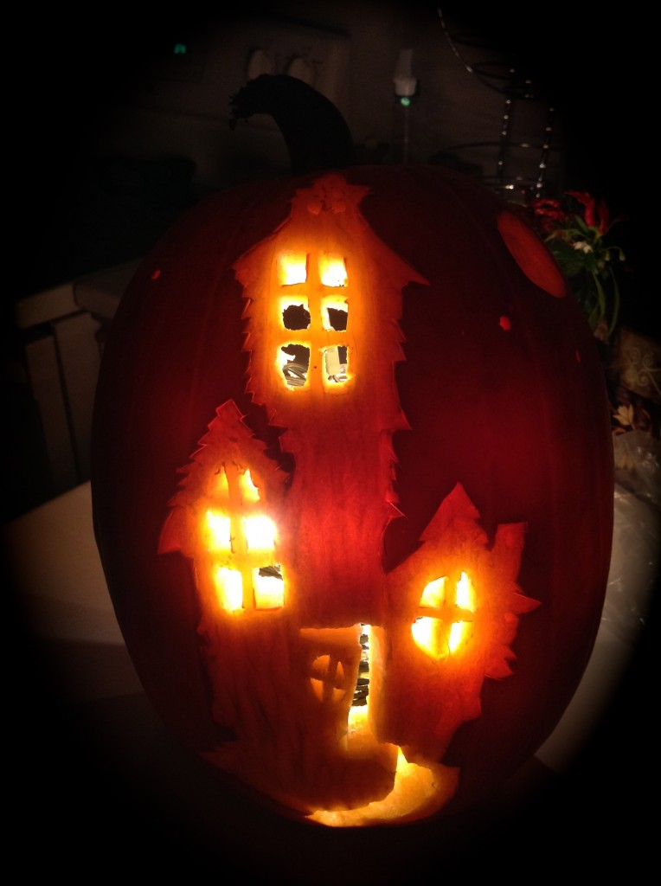](http://famillecarter.com/blog/wp-content/uploads/2013/11/IMG_1283.jpg) La maison de la sorcière\[/caption\]

Le 31 nos enfants étaient tout exités d’aller passer l’Halloween. “Vite, vite, vite!” Malgré la pluie nous avons passé aux portes. Après un peu plus d’une demi-heure, Ézékiel est tombé par terre et en même temps, a entrainé Caleb dans la boue. Résultat nos deux costumé se sont mi à pleurer à chaudes larmes. J’ai du aider Caleb qui était incapable de se relever. Le pauvre était imbibé de boue et me montrait ses mains toutes noirs. Puis Ézékiel était en grosses peine de voir son costume tout sale. Il avait peur que sa tante qui lui a gentiment prêté le costume, sois très fachée d'apprendre qu'il était maintenant tout sale. Lui aussi en avait gros sur le coeur.

\[caption id="attachment\_1286" align="aligncenter" width="584"\][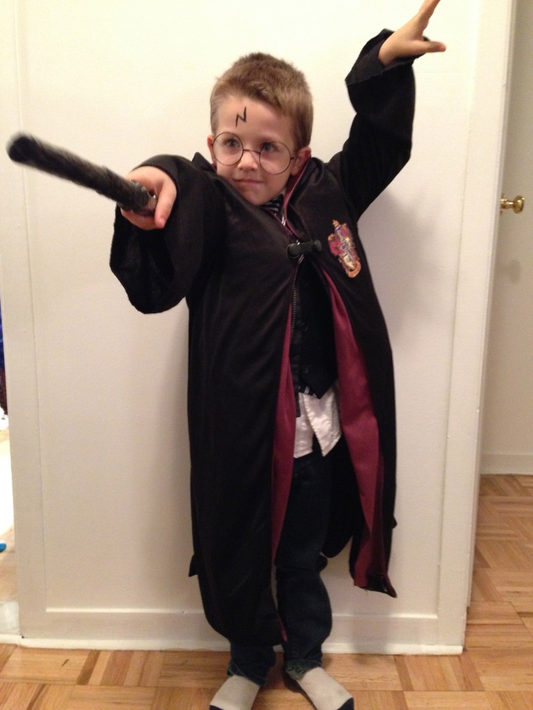](http://famillecarter.com/blog/wp-content/uploads/2013/11/IMG_1829.jpg) Harry Potter en action\[/caption\]

\[caption id="attachment\_1287" align="aligncenter" width="584"\][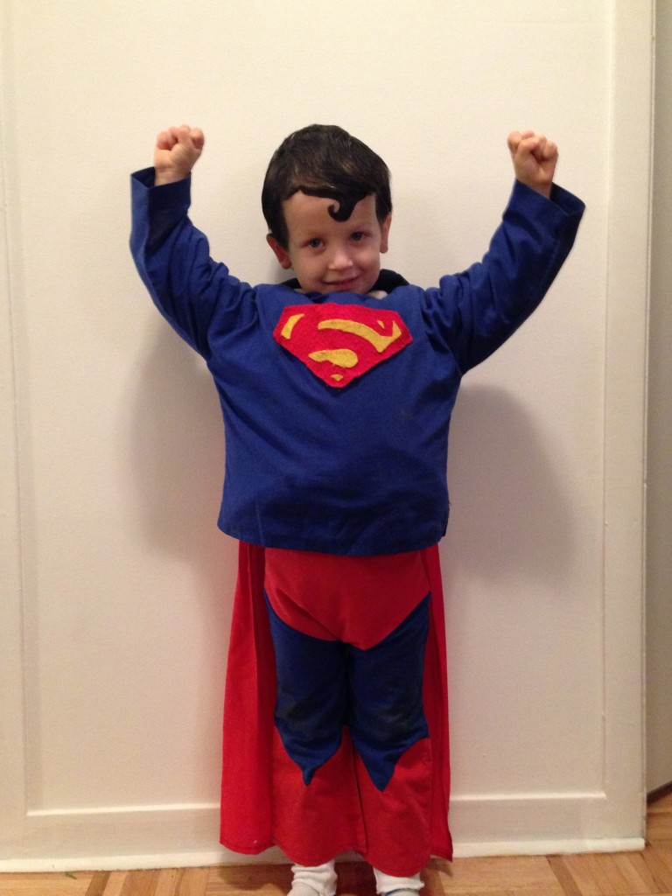](http://famillecarter.com/blog/wp-content/uploads/2013/11/IMG_1840.jpg) Super man qui nous montre ses gros muscles.\[/caption\]

À notre retour nous avons donné une bonne douche chaude aux enfants, suivi d’un chocolat chaud. Tout ça s’est quand même très bien terminé aux yeux de chacun. “Home sweet home”
