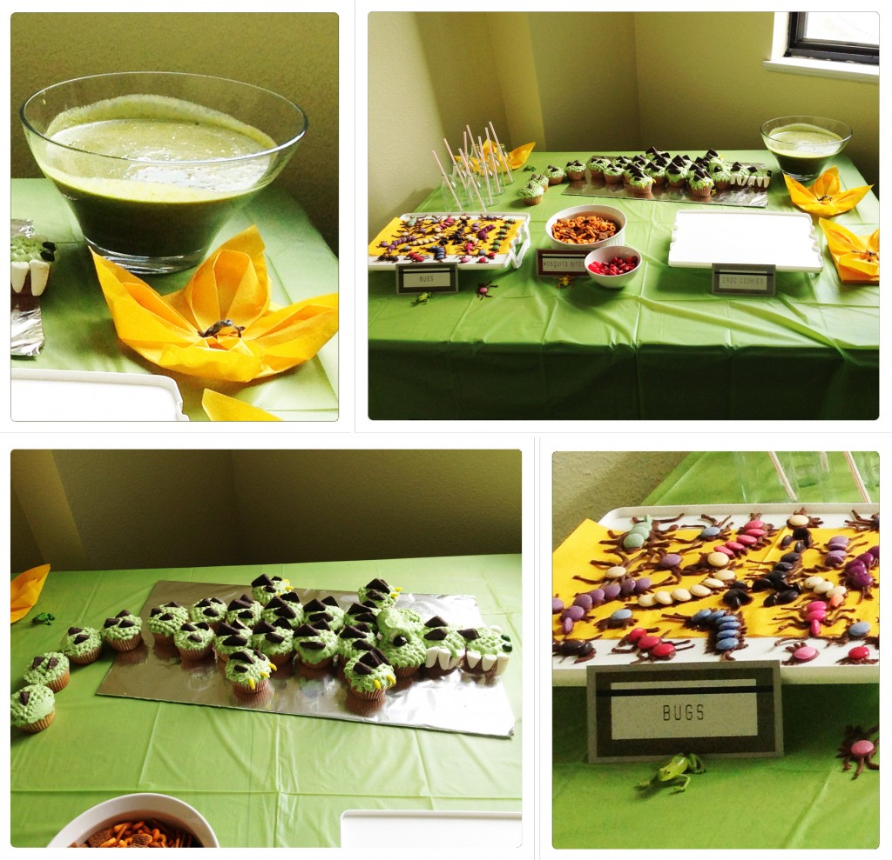

Ézékiel a eu droit à une fête dans un marécage. Voici la petite invitation qu'il a remit à ses camarades de classe.

Sur la table un crocodile en cup cake, brevage des smoothies vert (l'eau du marécage). Et comme petites bouchées: CROC COOKIES, MOSQUITO BITES ET BUGS. Trois jeux aimés des enfants: "Watch out for the crocs!",  "Don't get bitten by the mosquitos" et "Creppy crawling bug alert!" On peut voir Caleb qui se fait lui même des piqures d'insectes. Pour terminer en beauté on a eu une petite danse et le tour était joué. Mon petit homme était super heureux de son anniversaire.
