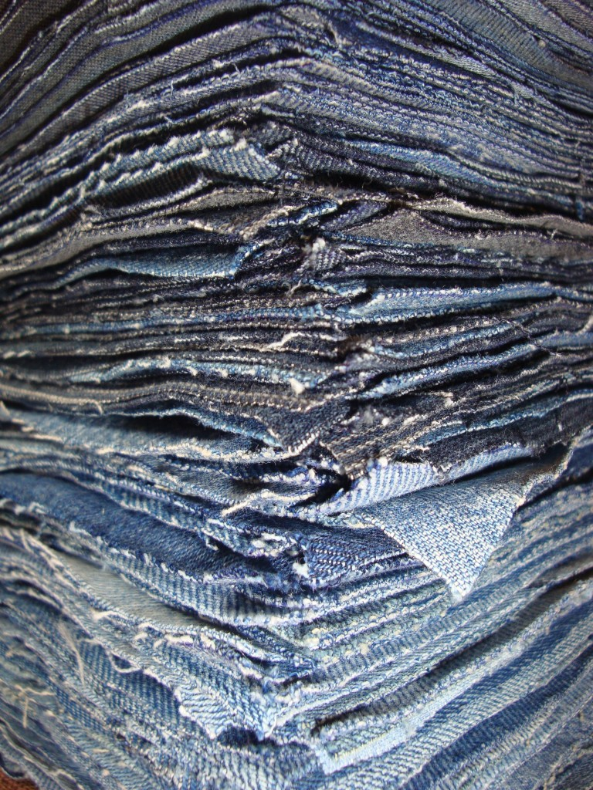
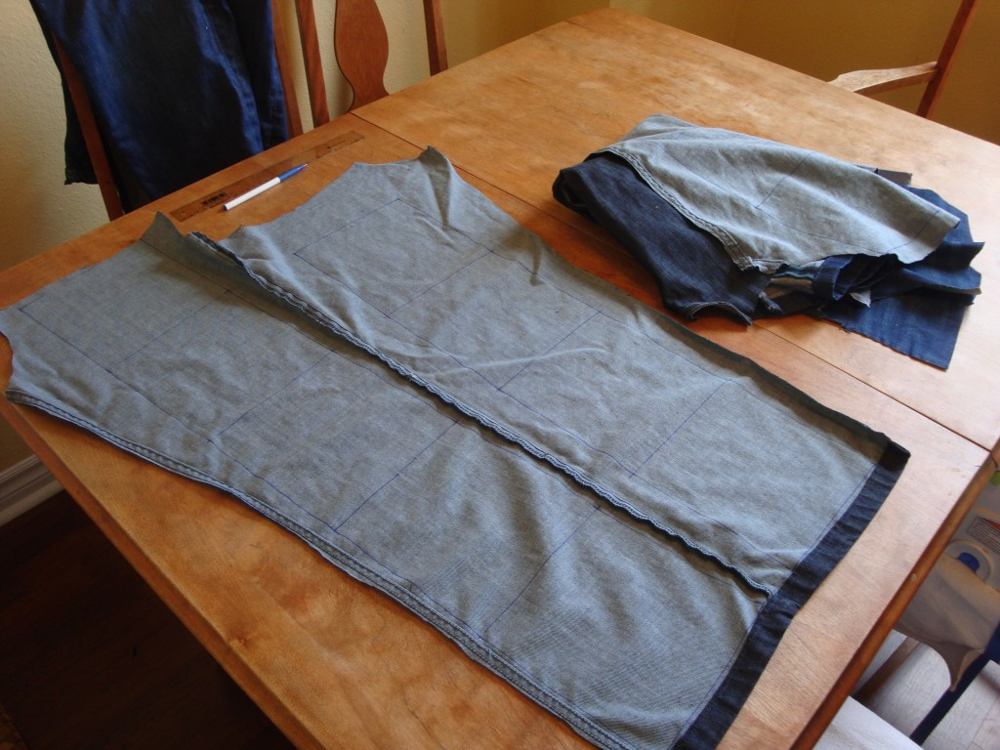
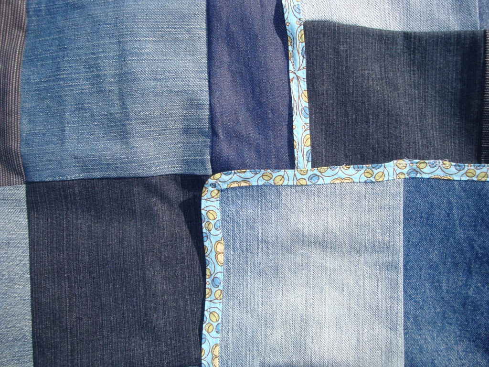
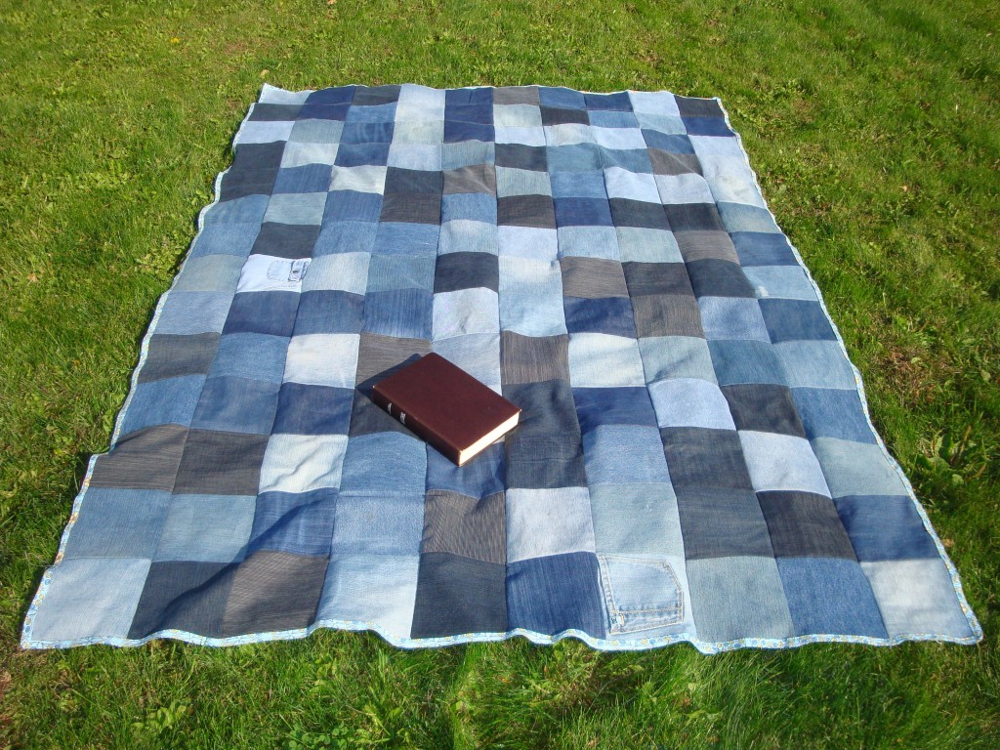
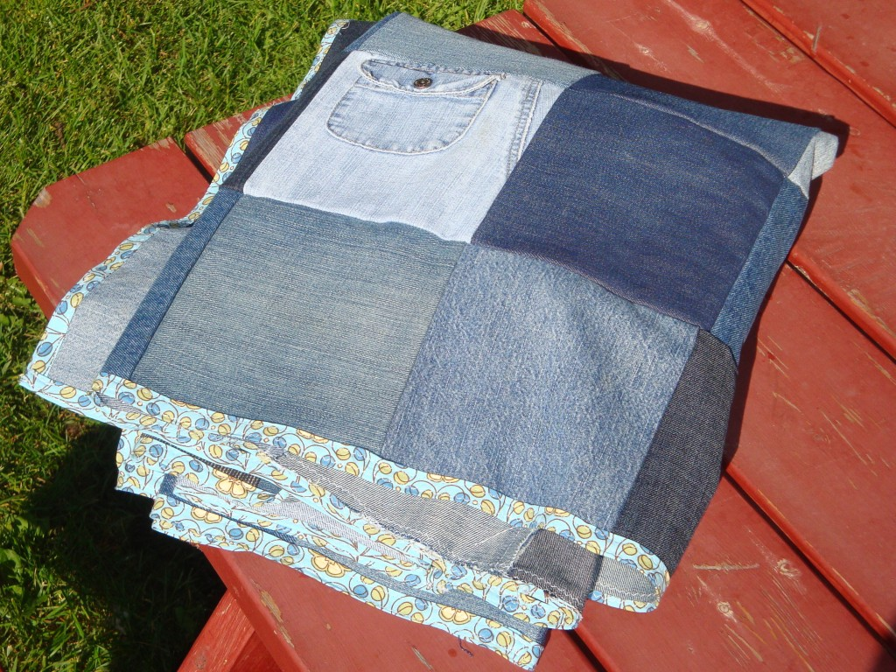

J'ai finalement réussi a réaliser un projet que j'ai commencé il y a plus de deux ans. Une courtepointe en jeans pour faire des pique-niques ou autres sorties extérieures. C'est pratique parce que le denim est un tissu très résistant.

La raison pour laquelle ce fut si long, c'est que ça ne va pas vite récolter des jeans usés. Pour chaque paire de pantalon, je pouvais en couper au maximum 16 morceaux. Ce qui est arrivé rarement. Et comme au total je devais avoir 140 carrés, ça été plus long que prévu. Je pense avoir utilisé au moins 15 pantalons, pour y arriver.

Rendu à faire le contour, j'avais plus que hâte de terminer ce projet. J'avoue qu'il reste encore une chose que j'aimerais faire sur la courtepointe. Je voudrais y faire broder le nom de notre famille, mais pour ça je dois encore trouver une âme généreuse qui me laissera utiliser la super machine à coudre.

 Un gros bravo à moi-même](http://famillecarter.com/blog/wp-content/uploads/2012/09/DSC04922.jpg)
