Et oui, nous avons commencé notre voyage par assister à nos réunions du dimanche qui était dans la ville de Mestre. Nous étions heureux de voir que nous étions capable de comprendre les grandes lignes de ce qui était dit en italien. Ce que j’ai préféré fut de chanter en italien le cantique de sainte-cène. L’italien est définitivement une belle langue à nos oreilles.

La chapelle de Mestre

[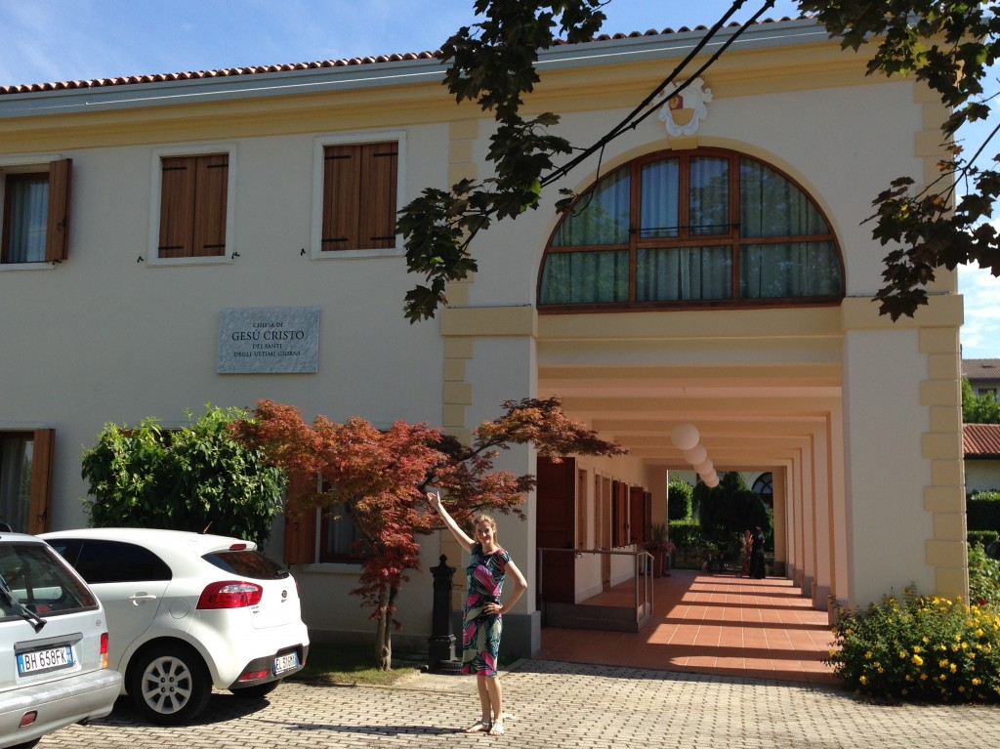](http://famillecarter.com/blog/wp-content/uploads/2014/06/IMG_2357.jpg)

 Mon homme sur un vaporetto

[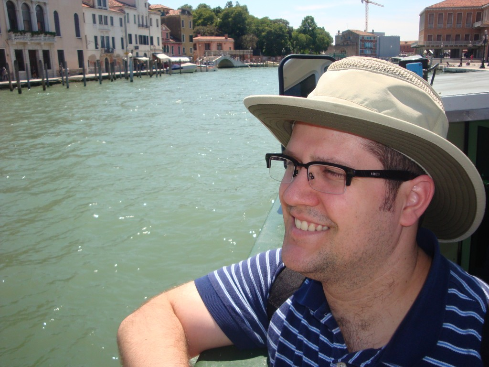](http://famillecarter.com/blog/wp-content/uploads/2014/06/DSC06480.jpg)

En après-midi nous avons prit le train pour nous rendre à Venise. De là nous avons embarqué sur un vaporetto (un bateau-bus) direction Place Saint-Marc. Il y avait foule! Sur cette photo on peut voir la tour “le Campanile” que nous avons monté. En haut il y avait une superbe vue des environs. Il y a aussi à droite “le palais des Doges”.

[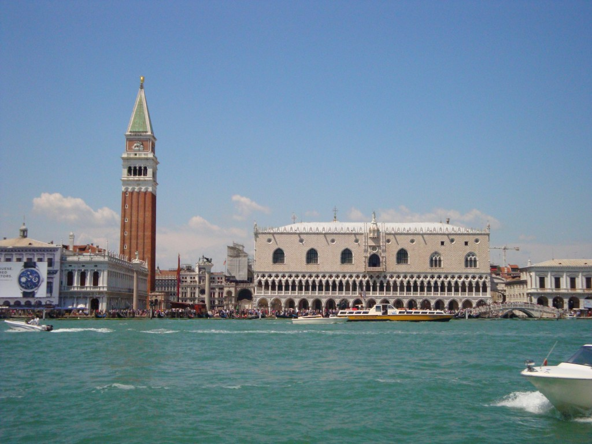](http://famillecarter.com/blog/wp-content/uploads/2014/06/DSC06494.jpg)

La vue grandiose du Campanile

[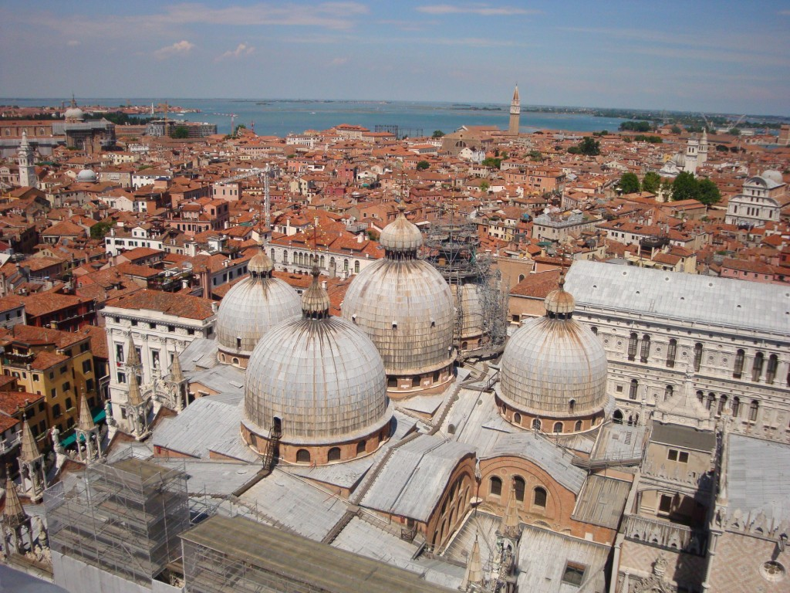](http://famillecarter.com/blog/wp-content/uploads/2014/06/DSC06527.jpg)

Suite à cela, nous nous sommes baladé dans les petites rues jusqu’à ce que nous croisions un quai de gondoles. On appelle son navigateur “gondolier” quand en réalité il devrait de sommer “ vrai-gino”. Il y’a avait pas mal de trafique sur le canal ce qui a surement souvent provoqué des accidents. Tous les bateaux se frôlent et se coupent le chemin. Il semblerait même qu’il y a beaucoup de frictions entre les gondoliers et les conducteurs de vaporetto.

Ce fût une belle balade, mais une fois dans la vie c'est suffisant.

[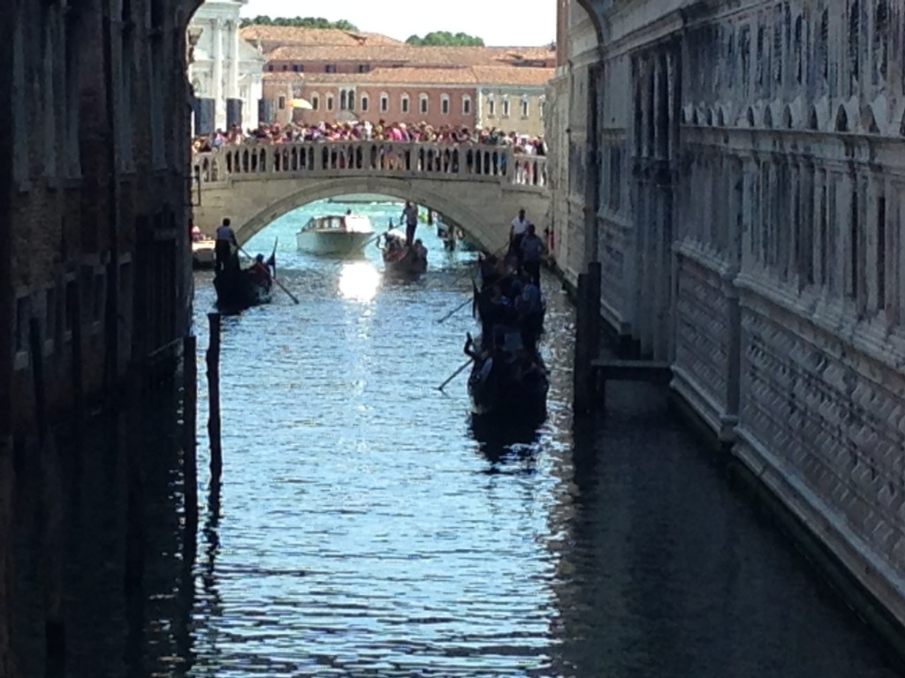](http://famillecarter.com/blog/wp-content/uploads/2014/06/IMG_2389.jpg)

Le vrai-gino qui dirigeait notre gondole

[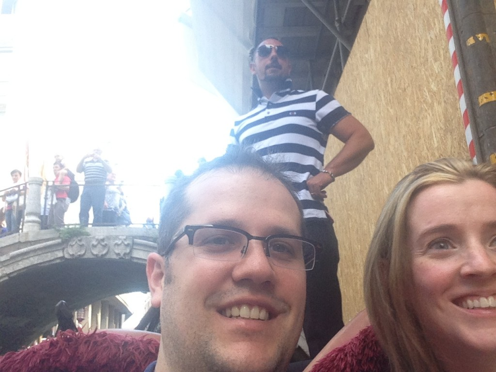](http://famillecarter.com/blog/wp-content/uploads/2014/06/IMG_2466.jpg)

 

[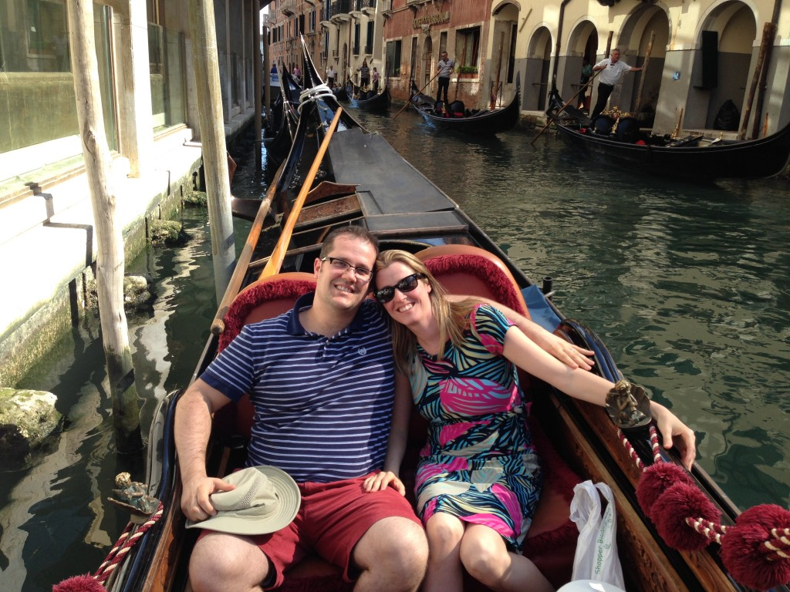](http://famillecarter.com/blog/wp-content/uploads/2014/06/IMG_2483.jpg)

Au tour de faire les boutiques, car il y en a à profusion. Mission: trouver un beau masque de Venise. Il faut savoir qu’il est coutume pour les touristes d’acheter ces masques qui représentent le carnaval de Venise. Cette fête remonte au temps du moyen âge et elle est encore soulignée de nos jours.

[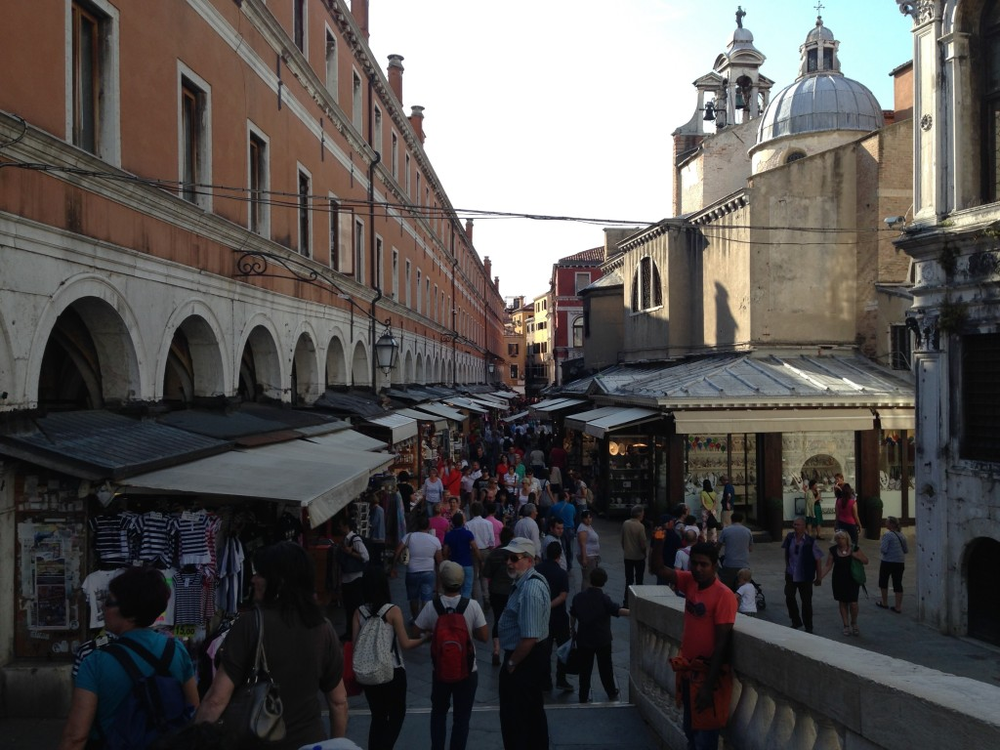](http://famillecarter.com/blog/wp-content/uploads/2014/06/IMG_2492.jpg)

 Devant la boutique d'un artisans de masques

[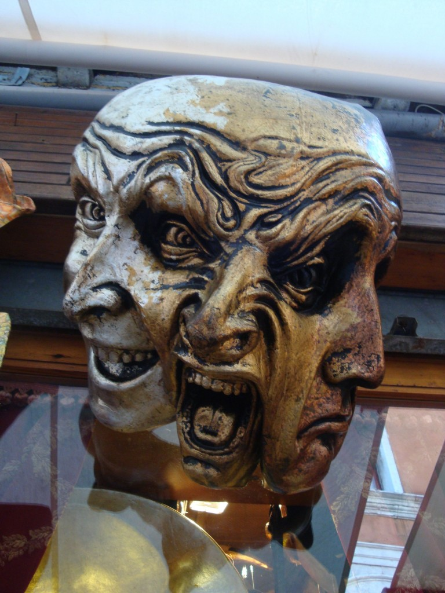](http://famillecarter.com/blog/wp-content/uploads/2014/06/DSC06566.jpg)

 

Il y en a pour tous les gouts.

 

[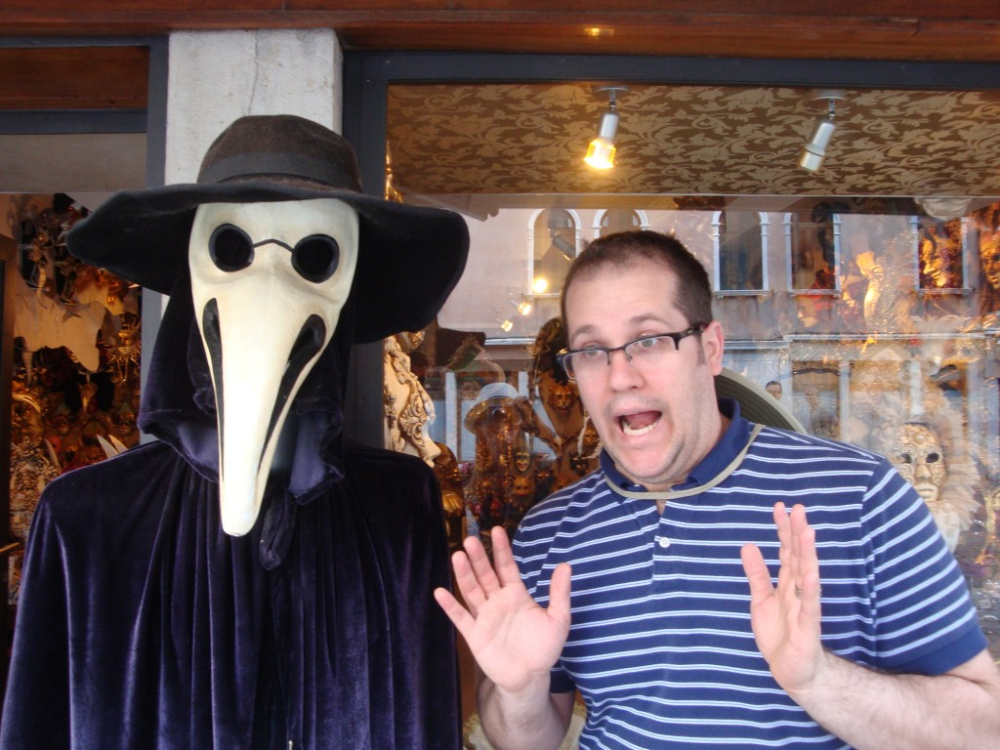](http://famillecarter.com/blog/wp-content/uploads/2014/06/DSC06609.jpg)

 

[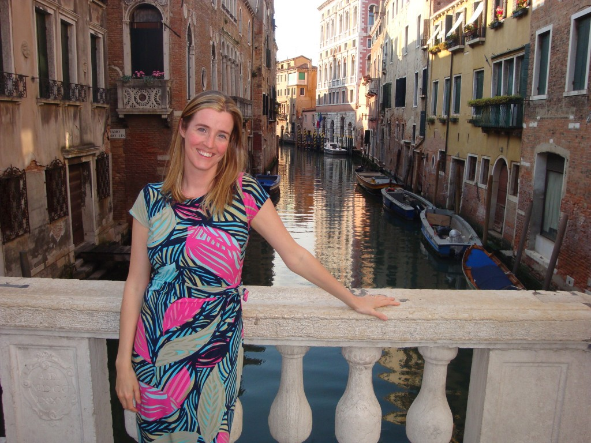](http://famillecarter.com/blog/wp-content/uploads/2014/06/DSC06599.jpg)

La journée terminée nous avons trouvé un beau restaurant à Venise. J’ai bien dit beau, mais malheureusement pas bon. C’est la seule place où nous avons mal mangé durant la semaine. Donc les restaurants à Venise sont à éviter. Ils survivent seulement grâce aux touristes qui comme nous ne sont que de passage et se font avoir.

[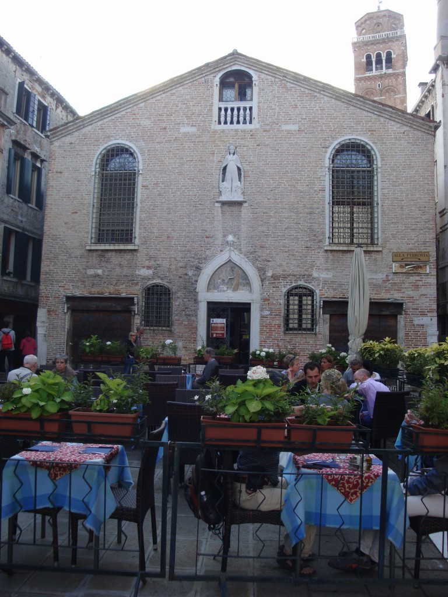](http://famillecarter.com/blog/wp-content/uploads/2014/06/DSC06607.jpg)
