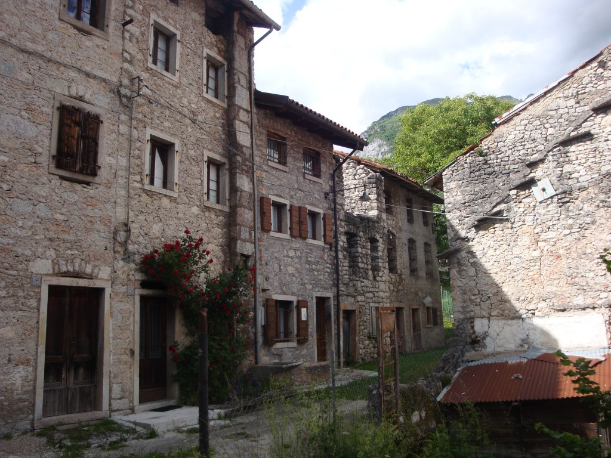
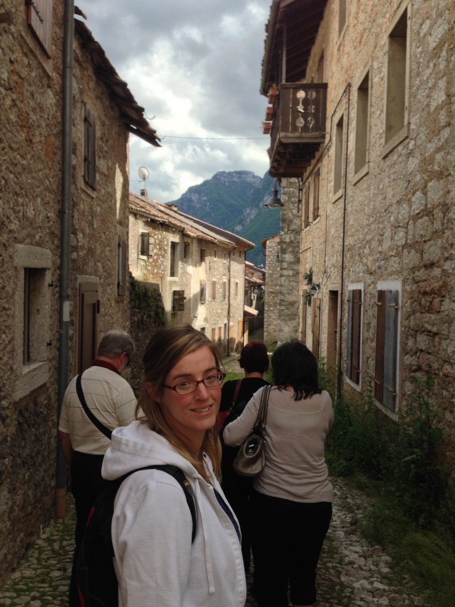
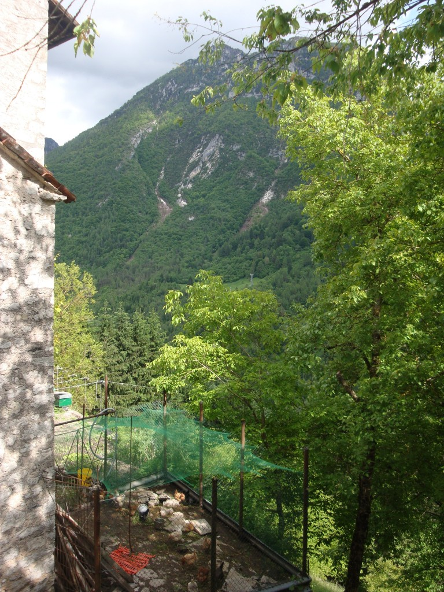
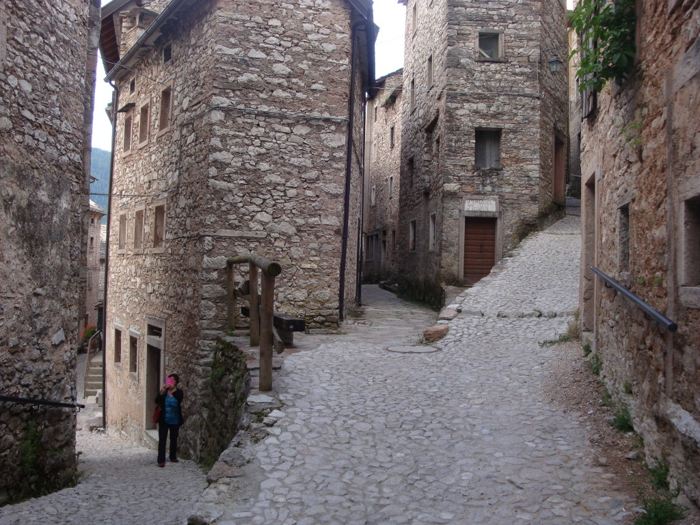
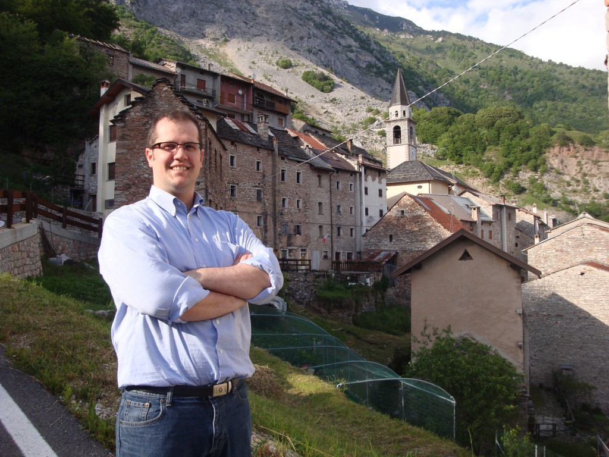
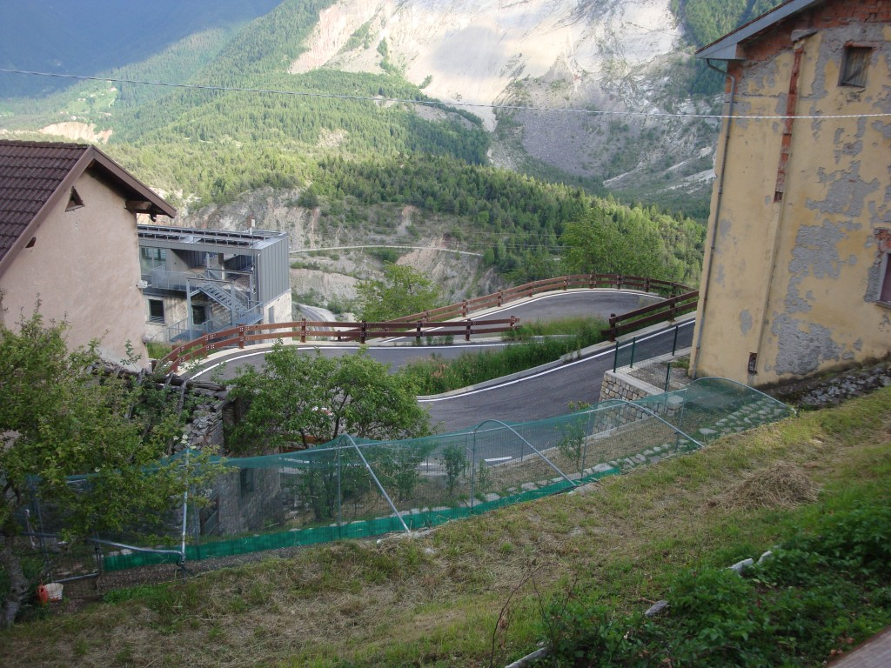

C’est un peu par asar que nous avons visité Erto et Casso, deux petits villages situé en hauteur des montagnes.

Premièrement Erto fut frappé par une tragédie en 1963. On dit qu’un projet de barrage aurait causé un gigantesque glissement de terrain. Une partie de la montage s’est écroulée dans la réserve d’eau d'un barrage “créant une vague de 70 mètres de haut”. Celle-ci s’abattue sur les villages, tuant ainsi plus de 2000 personnes.

Quand nous avons visité les lieux, j’avais de la difficulté à croire qu’on pouvais encore vivre à Erto. Plus de la moutier des lieux me semblait en ruine. Mais comme vous pouvez voir, il y avait bien des poules dans la cours de cette demeure et plus bas un potager. Comment s’y rendent’ils, puisqu’ils sont perché sur le flanc de la montagne? Et bien j’en ai aucune idée.

Deuxièmement Casso, petit village qui m’a semblé encore plus fantôme que ce précédent. On a du prendre une route non seulement casse-cou, mais aussi sens unique pour nous y rendre. Avec des palpitations au coeur j’étais soulagée de sortir de la voiture. Ce fut un village tout à fait dépaysant pour moi. Celui que j’ai préféré visité. La seule âme que j’y ai rencontré fut une vieille italienne habillée en noir qui tout souriante. Elle m’a invité en italien à poursuivre ma route.

Voici Jean-Michel devant la facade du village.

Et aussi voici une idée des zig-zags que nous avons affronté pour monter en altitude… une peanut comparé à la journée qui allait suivre.
