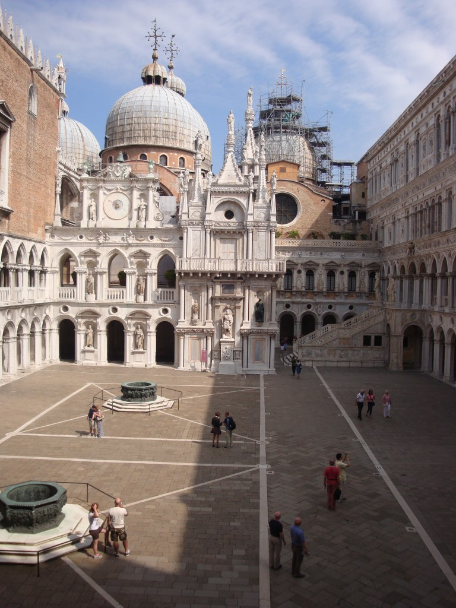
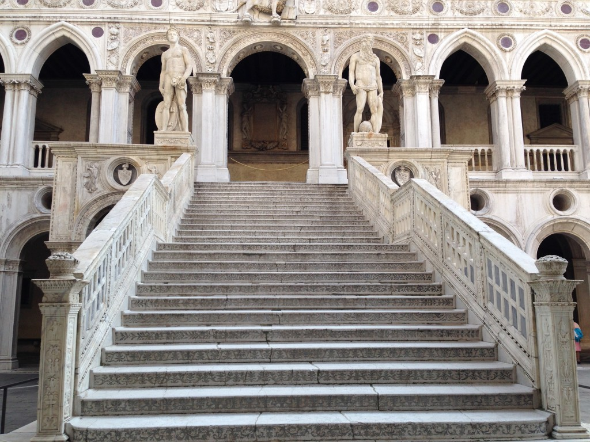
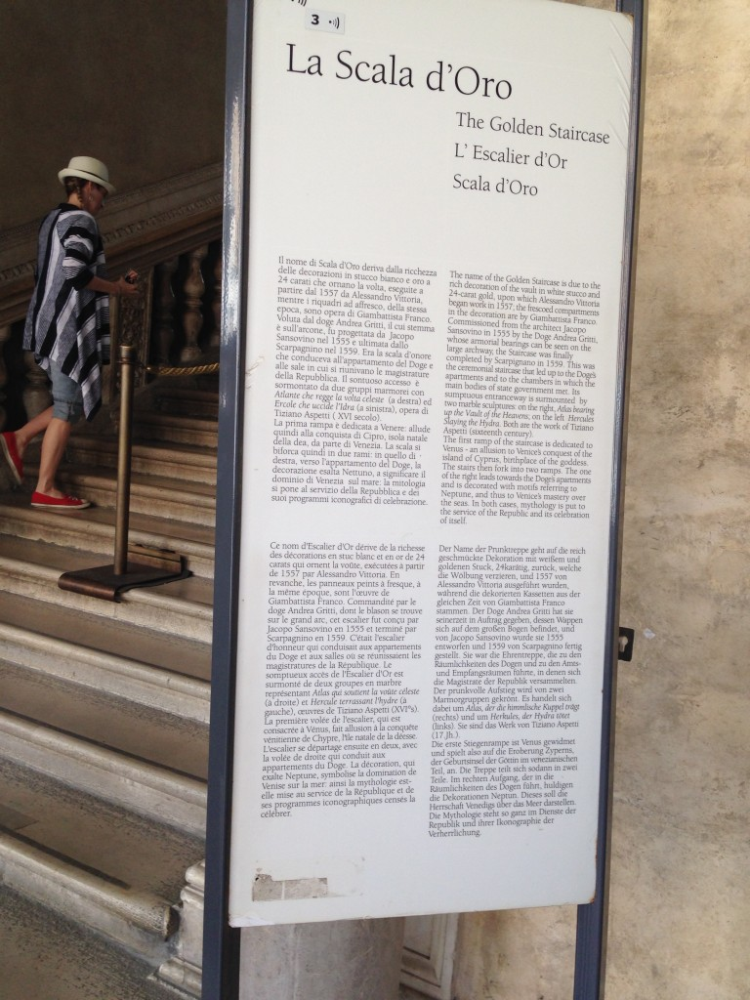
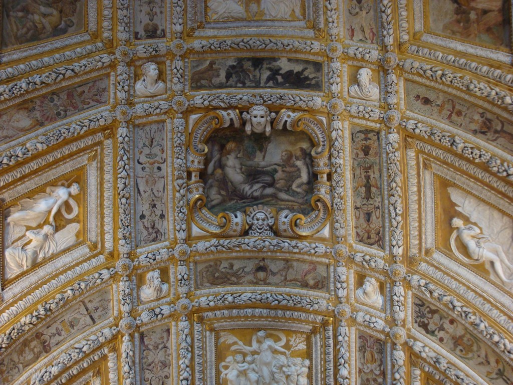
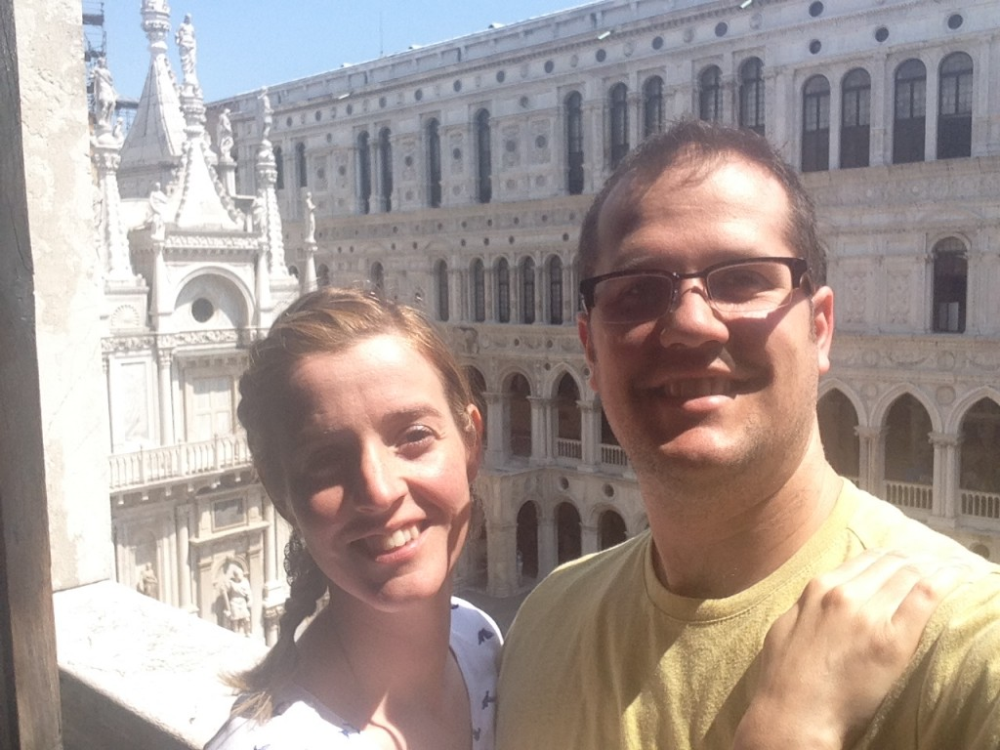
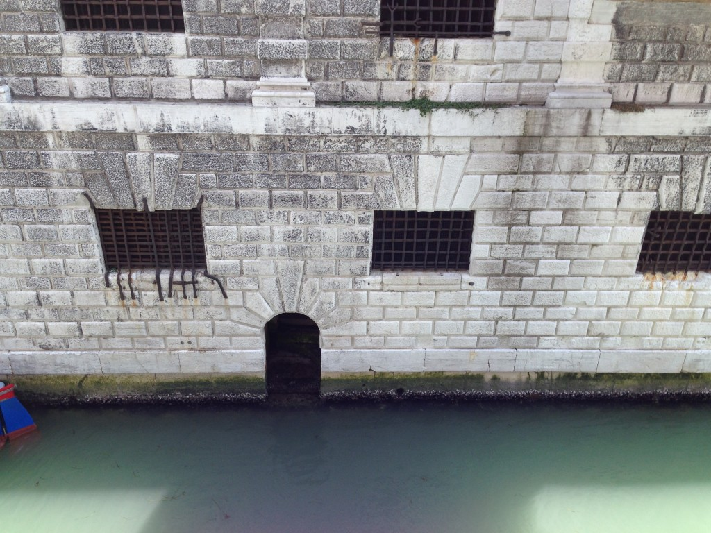
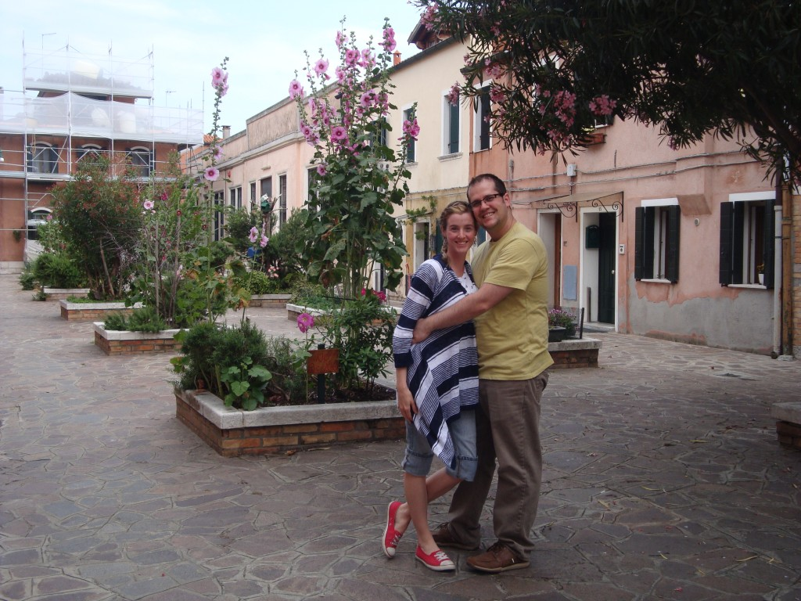
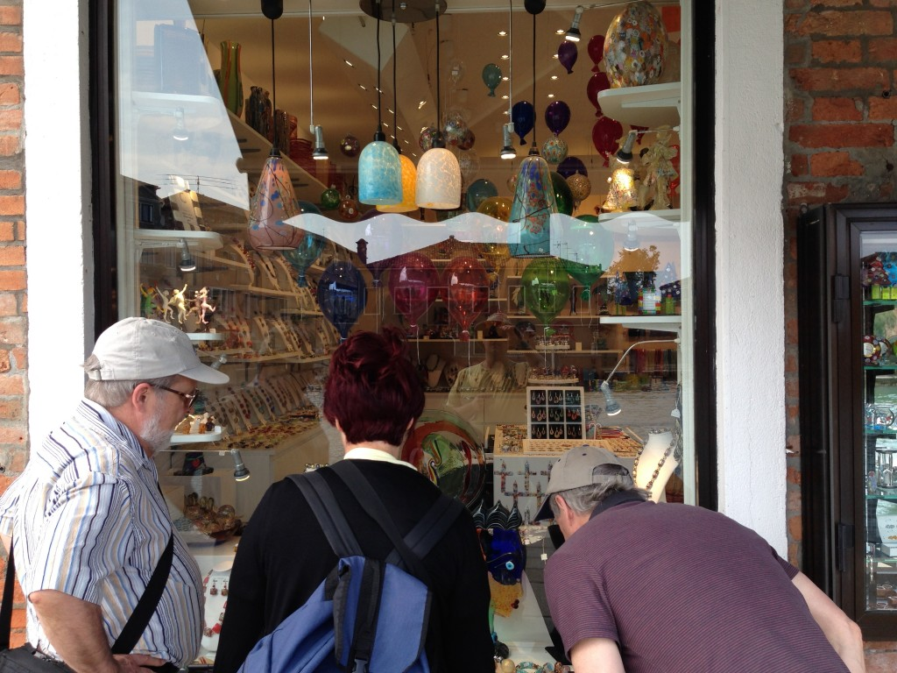

En avant-midi nous avons visité le palais des Doges. Ce grand bâtiment d’une extrême richesse servait de résidence au Doge  (l’homme qui détenait le pouvoir judiciaire de Venise). Nous avons extrêmement apprécié cette visite. Voici quelques unes des choses qui nous ont impressionné et dont nous avions eu le droit de prendre des photos.

L’escalier des Géants. C’est du haut des ses marches que le Doge s’adressait au peuple après son couronnement.

L’escalier d’or. Petit chemin modeste pour que le doge monte dans ses appartements tout aussi épurés.

La voûte entièrement recouverte de feuille d’or. Incroyable!!!

La prison… qui est collée sur le palais. Méchant contraste dans la décoration.

Bon, après un peu d’histoire nous avons reprit le vaporetto direction Murano, une petite île bien connu pour ses artisans souffleurs de verre. Ouf, moins de touriste ça fait du bien. Par contre on fait terriblement attentions lorsque l’on rentre dans les boutiques. Il ne faut surtout pas casser quoi que ce soit parce que leur art coûte très, très cher.

C’est presque plus sécuritaire de regarder à travers les vitrines.

