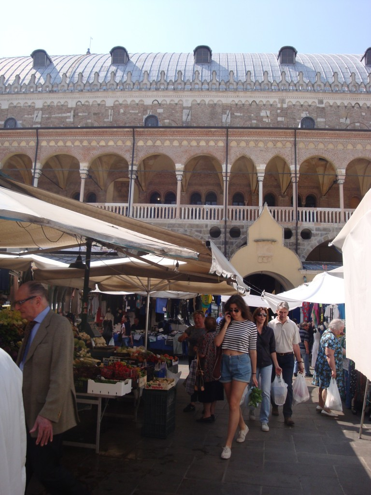
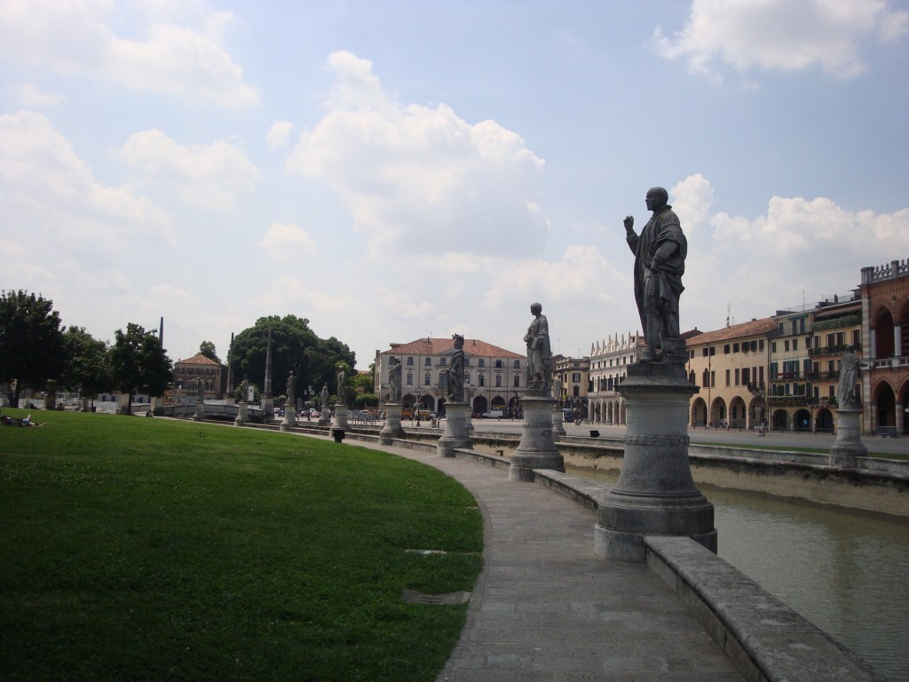
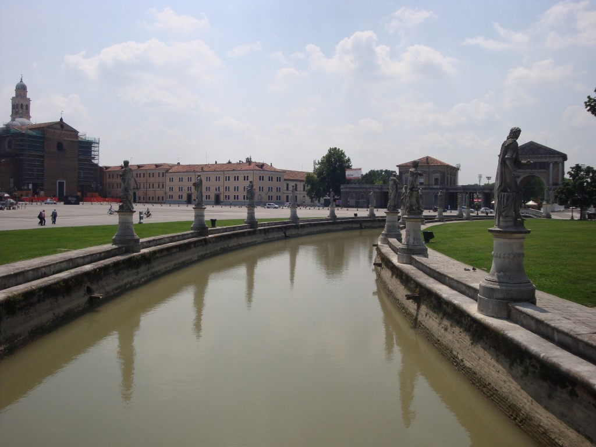
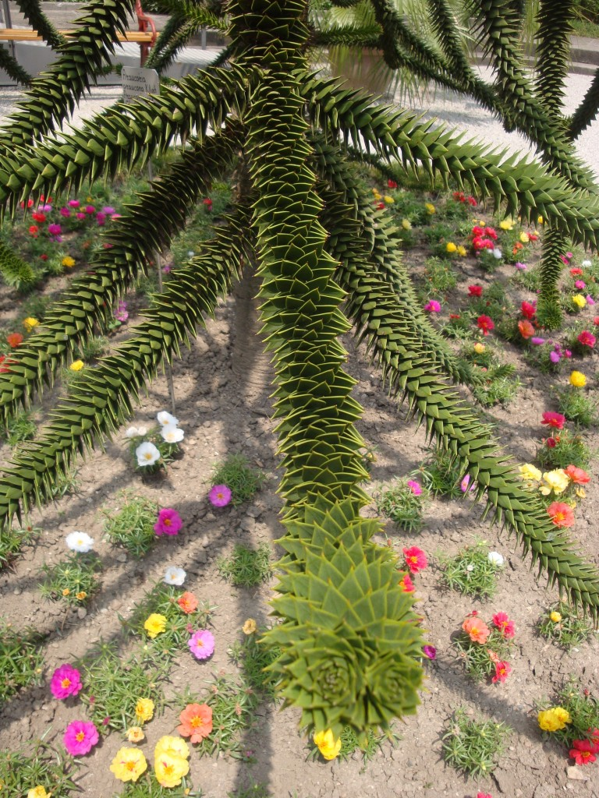
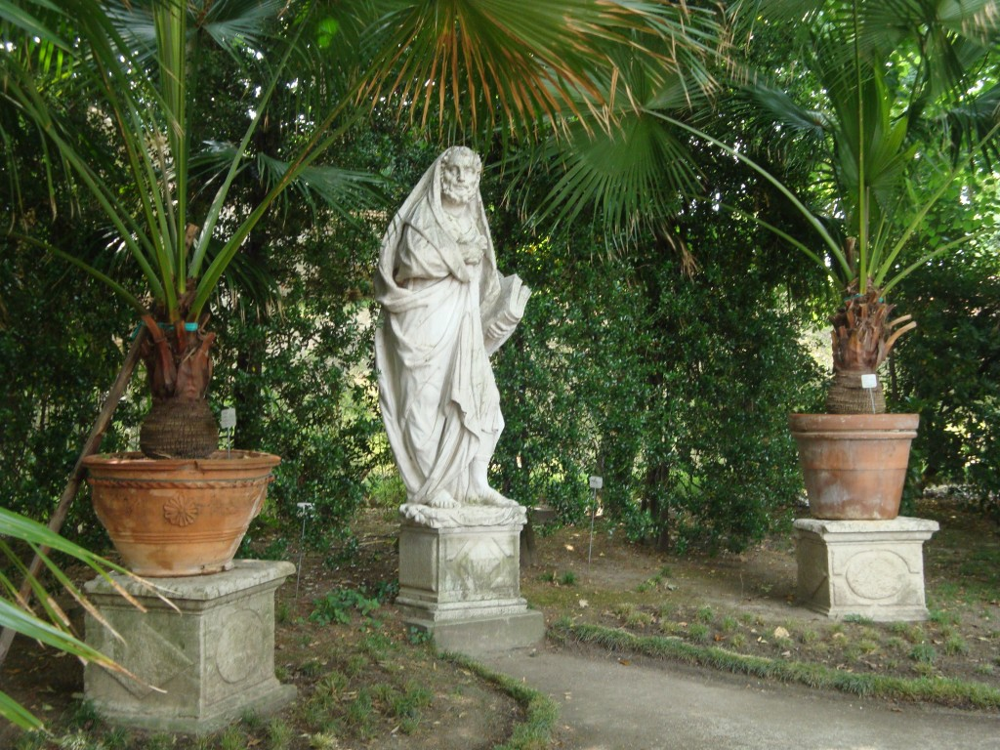
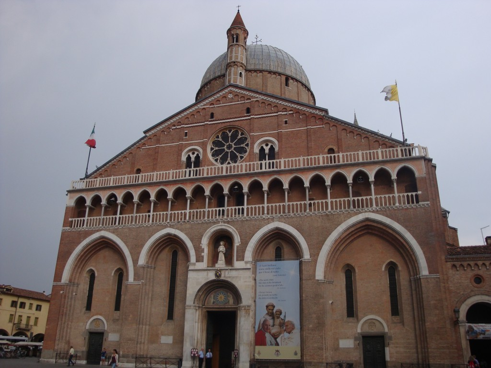
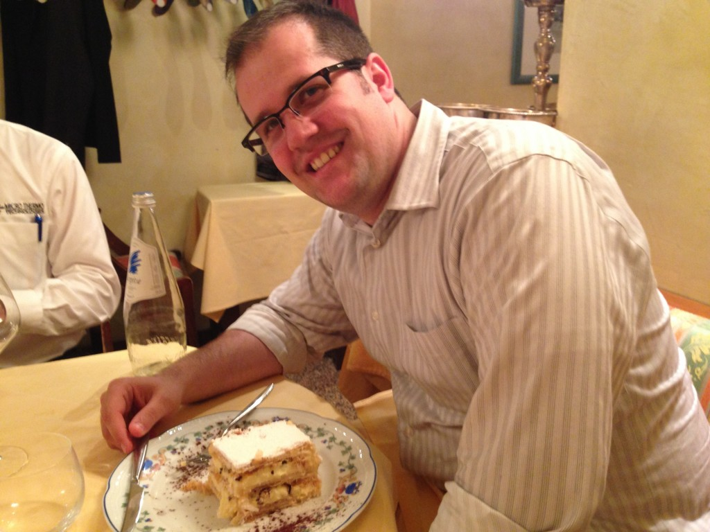

Les hommes nous ont laissez toute la journée dans la jolie petite ville de Padoue, une ville universitaire. On s’est vite rendu compte qu’à l’extérieure des grandes villes presque personne parle anglais. Donc, bonne chance!

Parmi nos découvertes de la journée, la piazza Prato della valle. Une très grande place publique entourée d’un canal et de statues. Superbe!

Le jardin botanique le plus ancien d’Europe. Aussi cet arbre m’a bien impressionné.

 

La basilic St-Antoine m’a aussi charmé avec le cloître du Magnolia

 

En soirée nous avons eu droit à un souper d’affaire. Regardez-moi la petitesse de ce mille-feuilles fraichement fait. Incroyable!

