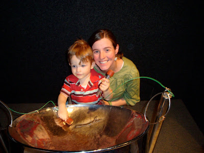
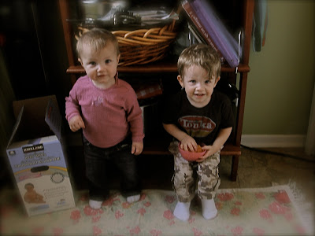

En fin de semaine on a eu le plaisir d'avoir la visite de Doudou, Phil et Zoé. On a profiter du peu de beau temps pour aller au parc et au Centre des sciences.

  

Maman et Zeke au Centre des Sciences

  

En gros nous avons joué, joué puis rejoué à des jeux. Au total 2 games de Settlers of Catan, 3 de San Juan, 1 de Bonanza et puis 47 brassées de 500.

Pendant nos séances de jeu intensive, Ézékiel et Zoé ont eu amplement le temps de s'apprivoiser et de s'apprécier. Assit l'un à côté de l'autre, ils ont ri et joué ensemble.

  

Zoé et Ézékiel qui partagent des poissons.  

  

Ézékiel a aussi beaucoup aimé sa tante et son oncle. Petite anecdote à se sujet. Je pense que c'est dimanche, Phil lançait Zeke dans les air. Après quelques minutes Phil prend une pause, mais Ézékiel n'est pas du même avis: "Encore, encore!" Aucune réaction de Phil. Zeke voit qu'il n'a pas grand succès et se ressaye, mais cette fois il lui dit: "Again. Again!" Nous sommes tous parti à rire. Il est vite le p'tit!

  

On à déjà bien hâte de vour revoir!
