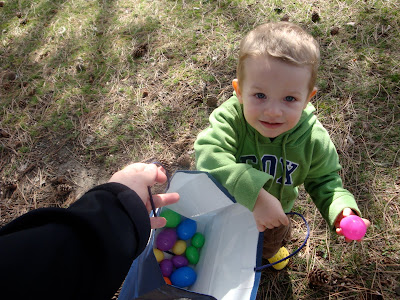
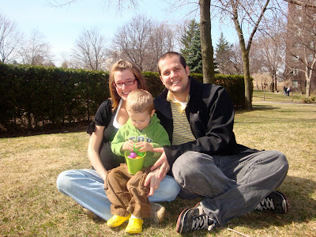
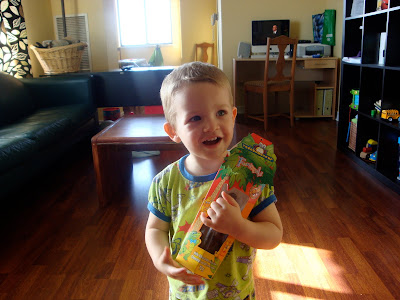
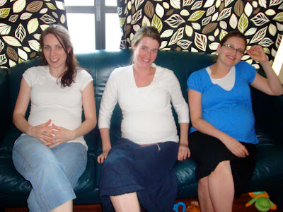
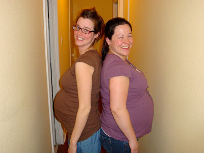

Ceux qui me connaisse savent que je suis miss chocolat et bonbon. Toutes les raisons sont bonnes pour en manger. Même si Pâques n'a aucun rapport avec ces sucreries, il fallait qu'on organise une chasse aux oeufs pour l'occasion.

C'est ce que nous avons fait vendredi passé en avant-midi. Il faut mentionner que la température était exceptionnellement chaude pour la saison et que le soleil était éblouissant. Ézékiel et Margo ont beaucoup apprécié cette petite activité. Elle fut suivie par un bon pique-nique au parc.

  

Zeke nous montre son trésor.

  

Cheese!

  

Durant la semaine j'avais vu un petit singe en chocolat sur l'étagère de l'épicerie. Je n'ai pas pu résister de l'acheté, ça représentait tellement bien Ézékiel. Le dimanche qui a suivi, nous avons offert le chocolat de Pâques à notre petit grimpeur à nous.

  

Il le tien comme un trophée, un oscar.

  

Maintenant un petit chapitre bedaine... Dimanche après-midi nous avons invité nos amis à venir écouter la dernière session de la conférence général chez nous. À un moment donné on s'est retrouvé trois bedaines assis sur le divan.

  

Emily (5 mois), Marjorie (7 mois) et Angie (8 mois)

  

Ce n'ai pas la seule fois de la semaine que j'ai comparé mon ventre. Mardi nous avons eu la belle visite des Groux. Catherine et moi nous nous sommes frotté la bedaine ensemble... c'est tellement le fun de pouvoir parler de grossesse avec quelqu'un qui le vit en même temps que sois. Merci Cat d'avoir blablaté avec moi de tout et de rien.  

  

