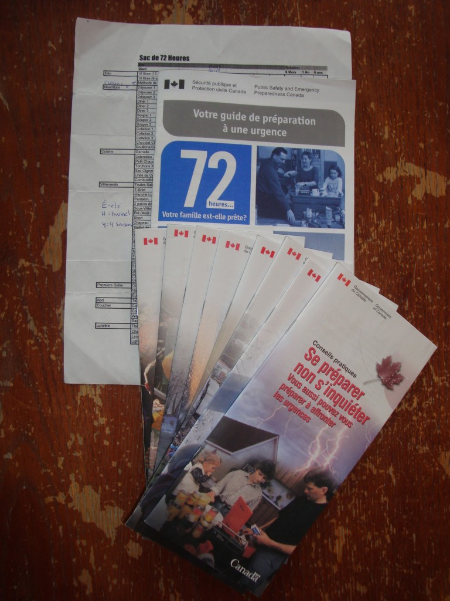
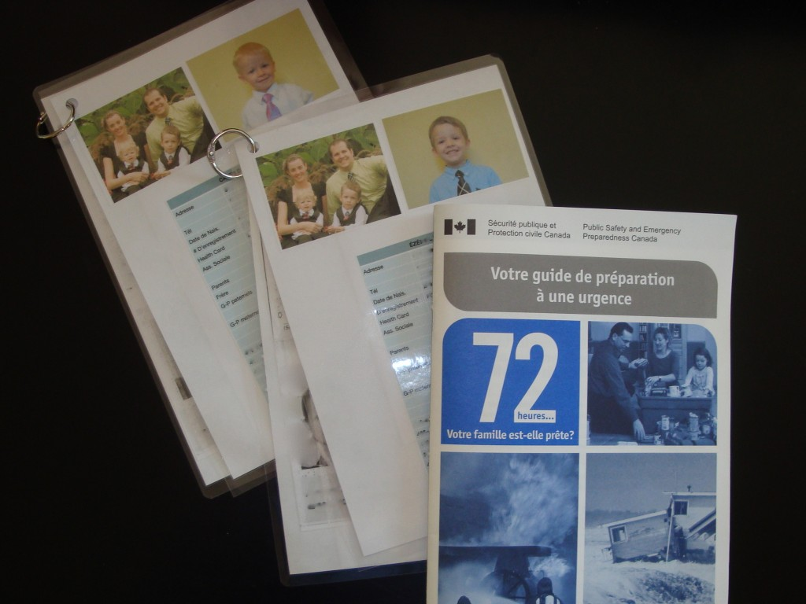
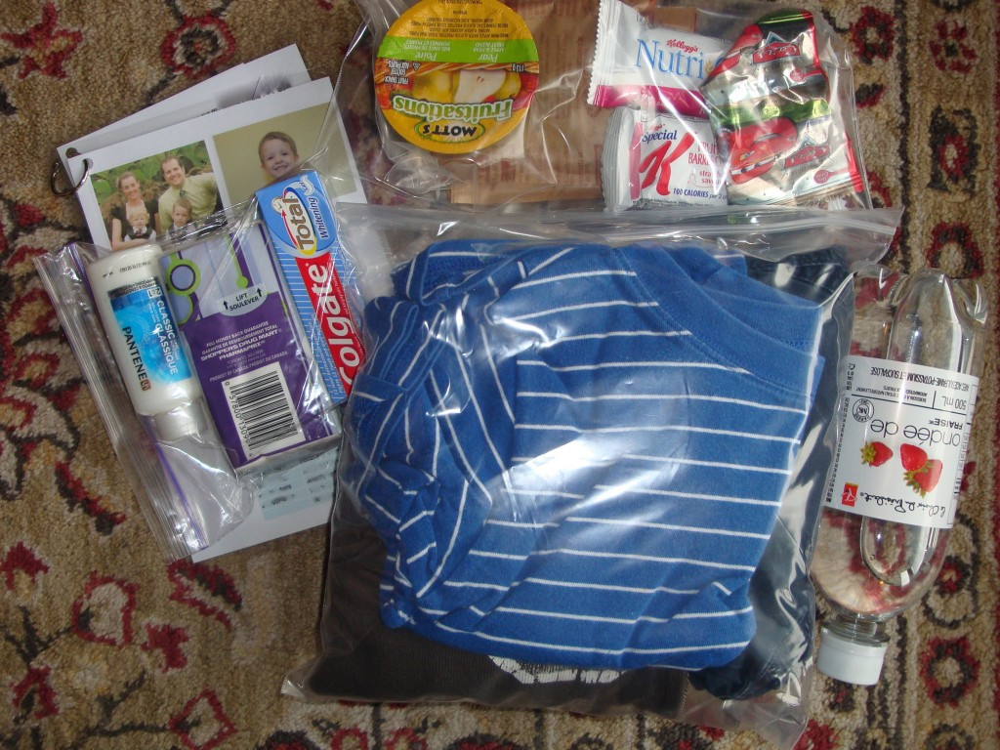
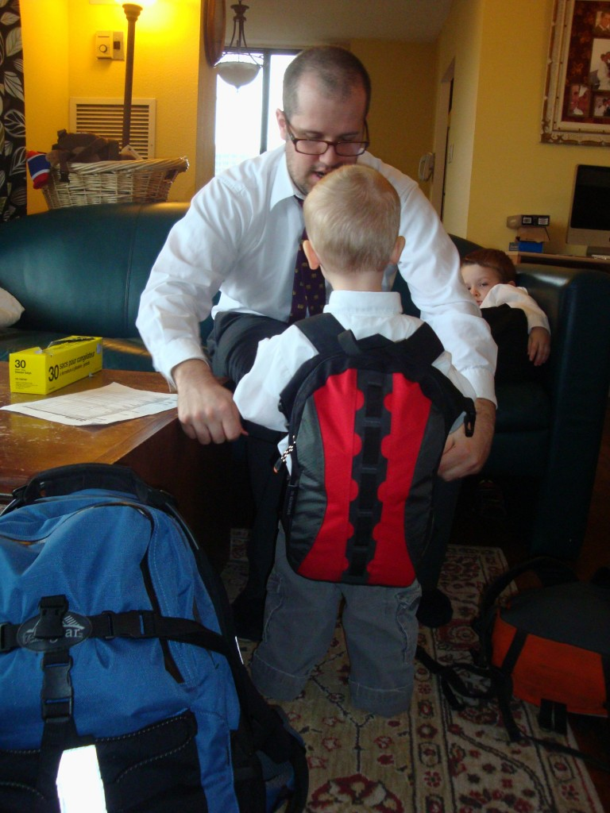
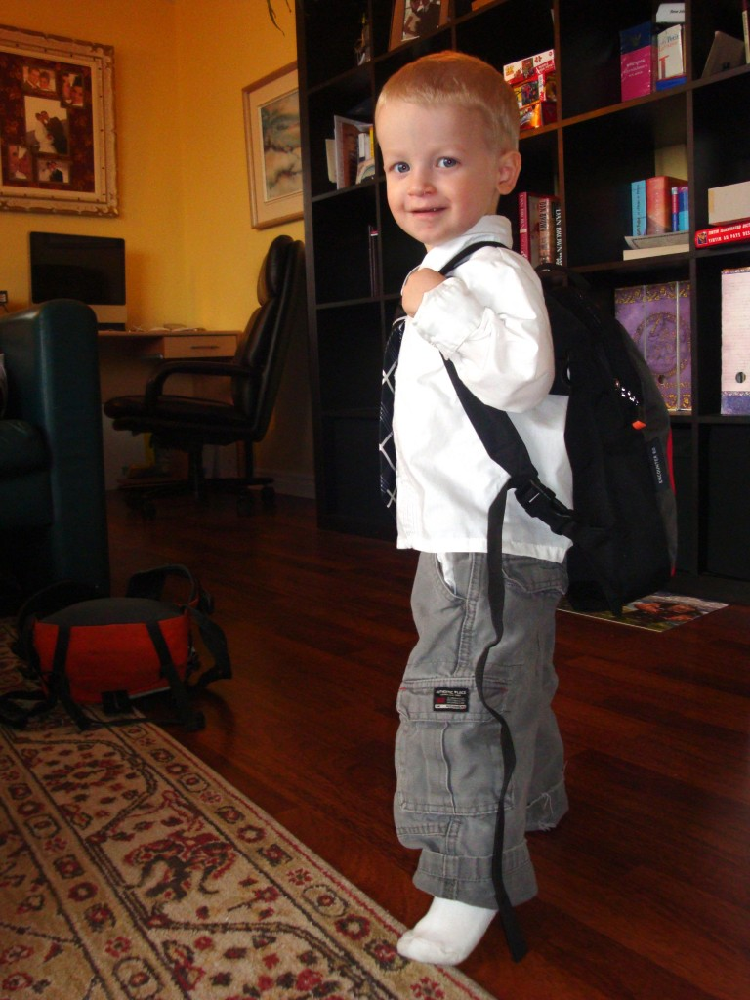
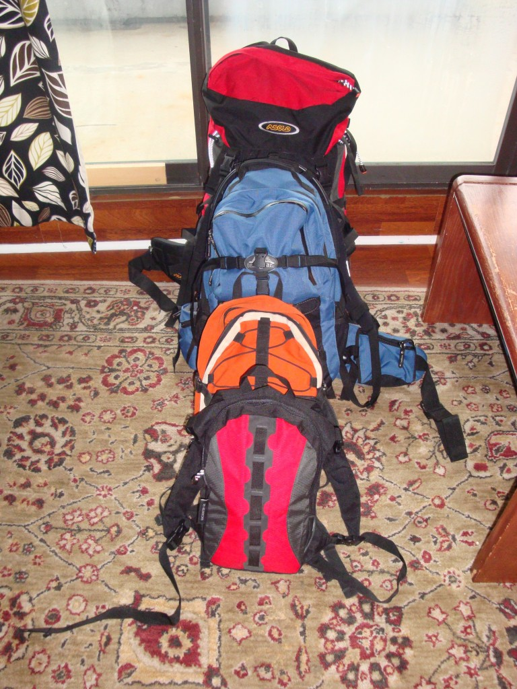

Il y a cinq ans, j'ai assisté à une présentation sur le sac de 72 heures. J'en avait déjà entendu parlé auparavant, mais cette fois-là c'était la première fois que ça m'a vraiment donné le goût de le faire. J'ai gardé toutes les brochures du Canada et je me suis dit : Un jour.

Il y a six mois je me suis décidée de m'y mettre pour vrai. La préparation fut plus longue que prévue. Entre temps, j'ai partagé mon projet avec ma mère. Elle m'a dit qu'elle avait écouté un reportage intéressant sur canal D, intitulé [«Après l'apocalypse»](http://www.canald.com/emissions/docu-d/505498712-apres-l-apocalypse/). Il s'agit d'une documentaire de 80 minutes sur le pire des scénarios en cas de pandémie.

Ça peux sembler alarmiste, mais comme dit mes brochures du gouvernement: Se préparer, non s'inquiéter. Donc j'ai regardé le documentaire. Ma conclusion, il faut en prendre et en laisser. Mais j'ai quand même apprécié connaître la vision de professionnels. Et ça m'a donné un autre petit boust pour rassembler ce que j'avait besoin.

Donc, en fin de semaine nous avons finalement prit le temps en famille d'assembler les sacs de chacun. En réalité il nous manque encore des choses pour dire qu'on est près à 100%, mais au moins je sais qu'un a quelque chose de près au cas ou...

Voici les outils qui m'ont été donné à l'origine et qui m'ont beaucoup aidé. Une liste du sac de 72 heures, comment faire un plan d'urgence et huit brochures de conseils pratiques.

Les fiches d'informations pour mettre dans les sacs des enfants en cas de séparation.

Les sacs des enfants contiennent le strict minimum pour ne pas que ce soit trop lourd.

Papa qui aide fiston a ajuster son sac.Caleb fière de le porter même si c'est un peu lourd pour lui.Le résultat de notre projet.

Maintenant il nous reste à trouver les objets manquants.

Dernière chose que je voulais partager avec vous. Dans notre petit appartement c'est impossible de faire des réserves, mais je suis tombée sur un super de bon site. Et je me suis dit: «Un jour…»

Ça s'appel [SHELFRELIANCE](http://canada.shelfreliance.com/home) pour ceux que ça intéresse. Bonne préparation!
