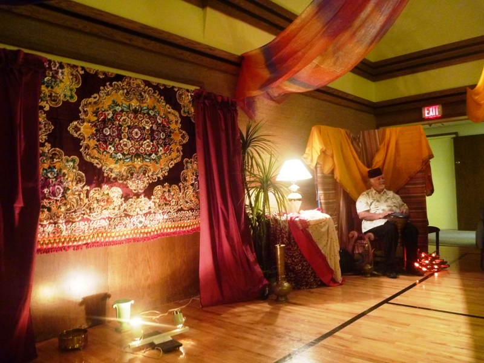
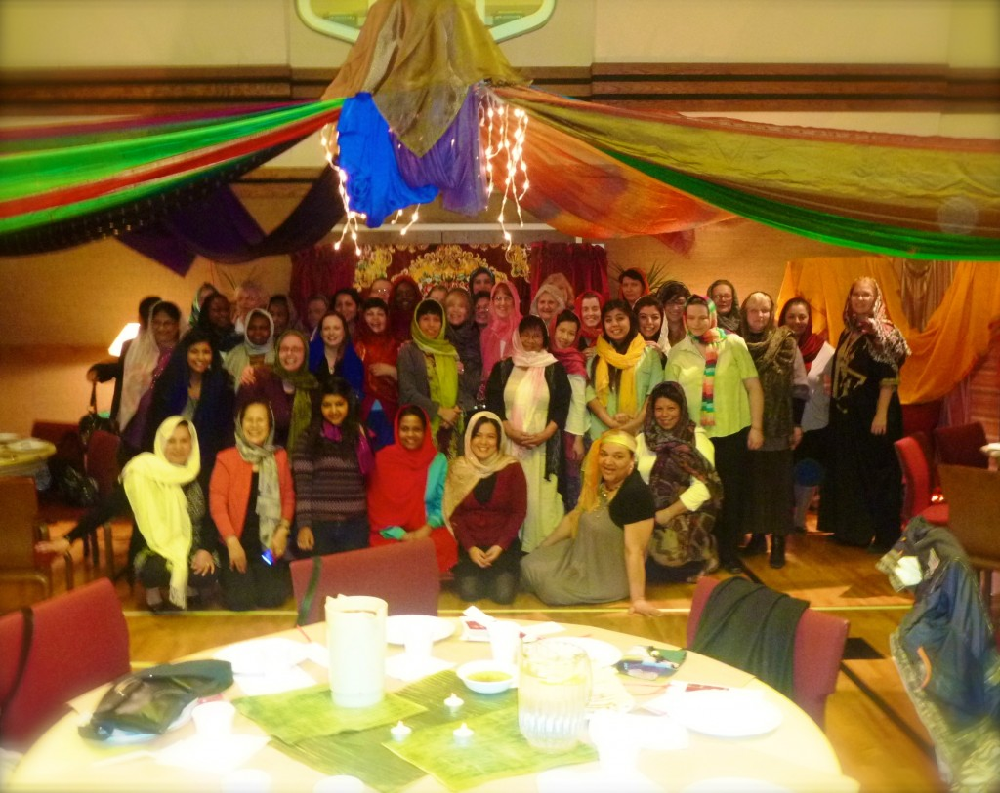
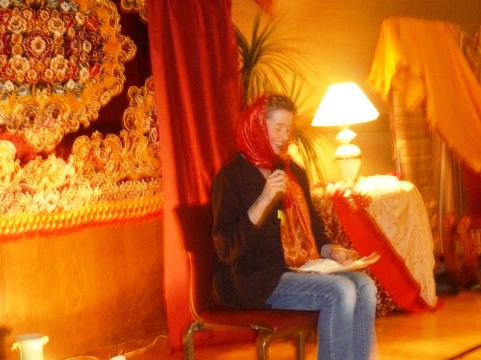

Je dois absolument vous partager l'activité de la Société de Secours à laquelle j'ai participé ce mois-ci. Elle était instructive et très édifiante.Women of Wisdom consistait à passer la soirée plongé dans l'atmosphère biblique. On nous à servi des mets authentiques de la culture juive. C'était original puisque chaque repas portaient un nom comme: «Rebekah's Lentil Stew», «Ruth's Unleavened Bread», ou encore «Eve's Semolina Ashishot (Dessert)» Nous avons très bien manger et parler tout en écoutant la musique, ce qui créait l'atmosphère recherché. Puis, pendant le dessert, nous avons regarder deux danses.

Le plus gros de la soirée nous avons rencontré six femmes biblique, ce que j'ai trouvé le plus intéressant et touchant. Il y avait Eve, Sara, Ruth, Debora, Marie de Magdala, et « la femme sans nom ». C'est moi qui a eu la chance de d'interpréter cette dernière. Il s'agissait de la femme qui a touché le vêtement de Jésus dans l'espoir d'une guérison.

Ainsi nous avons pu connaître un peu mieux ces femmes de foi et de courage. Des exemples dans la bible qui sont plus discrets. À la fin de l'activité, tout le monde était en accord pour dire que la soirée avait été un vrai succès.
