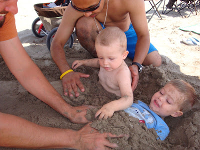
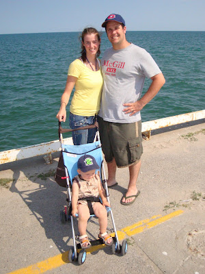
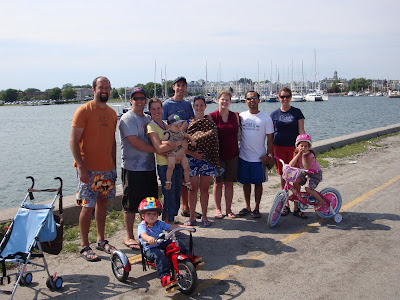

Hier nous avons passé une super de belle journée à la plage de Cobourg. Alors que nous revenions à la maison j'ai dit à Jean-Michel que dans quelques années que c'était ce genre de souvenir qui allait faire en sorte qu'on allait s'ennuiller de notre vie à Toronto.  
  
On arrive tôt le matin, on choisit un bon spot, les amis viennent nous rejoindre, les enfants jouent dans le sable, les hommes courent dans l'eau, les femmes papotent en se faisant griller la couenne et puis ça sens bon la crème solaire.  
  
En deux ans on a été à quelques plages, certaines plus que d'autres. Les voici dans l'ordre de préférence.  

  
#1 La plage de Cobourg  
  
#2 La plage de Brimley  
  

#3 Presqu' Ile (Parc provincial) Il faut mentionner qu'il y a deux emplacements. La vraie plage de soit disant sable, est très peu profonde et sent mauvais. Pour ce qui est de la plage rocailleuse et glissante elle est pleine de sensations fortes. À ne pas y aller avec des enfants!  

  
#4 La plage de Woodbine  
  
#5 La plage de Toronto Island Park  
  
  

À la plage de Cogourg,  
Zeke se fait enterrer dans le sable avec Gavin.  

  
  

On prend une petite marche vers le phare.  

  
  

Avec nous la famille Peterson, Moreton et Vallejos.  

  

